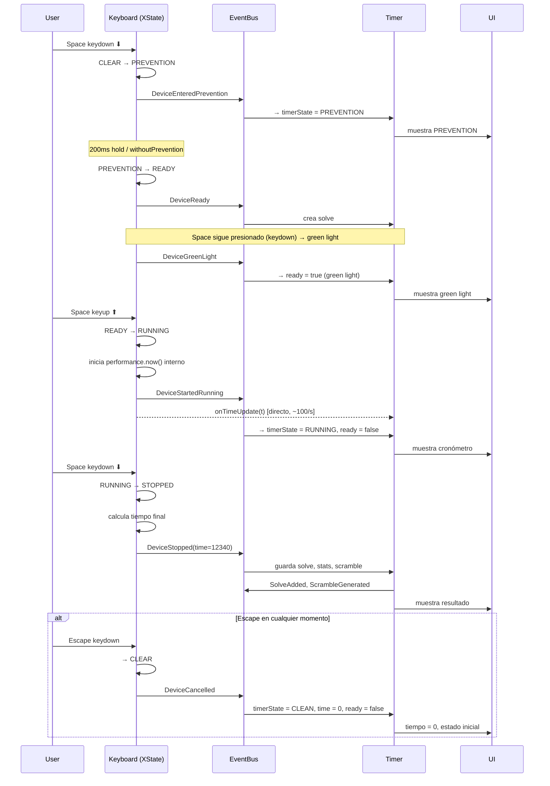
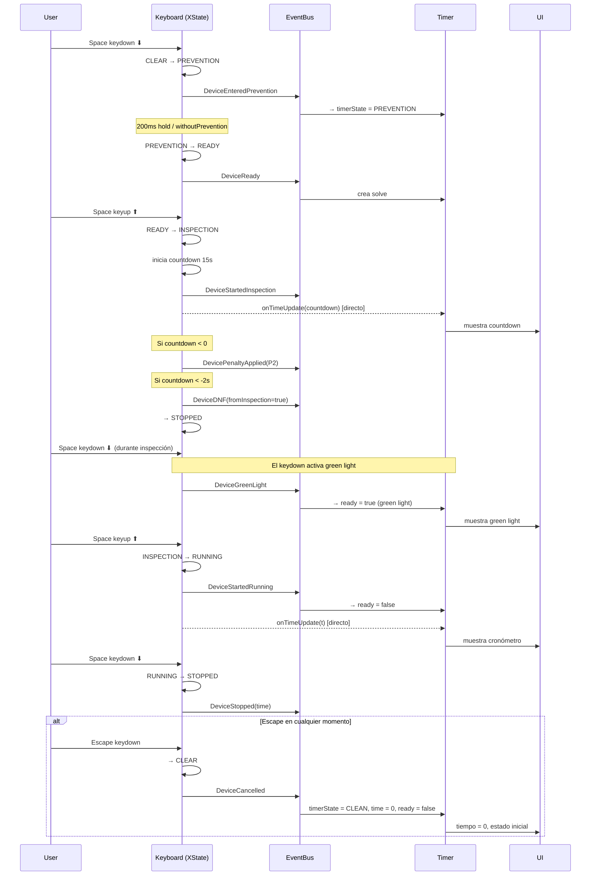
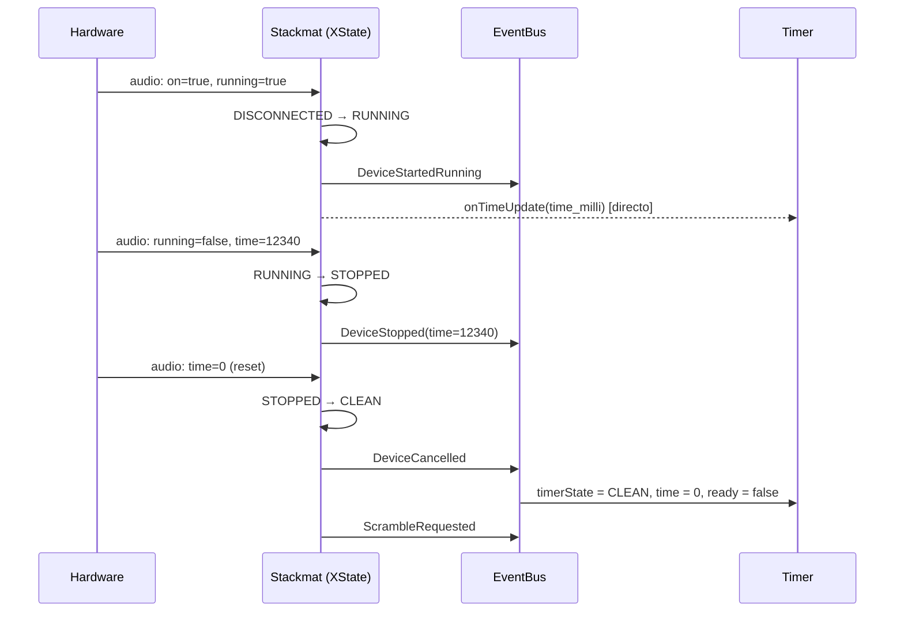
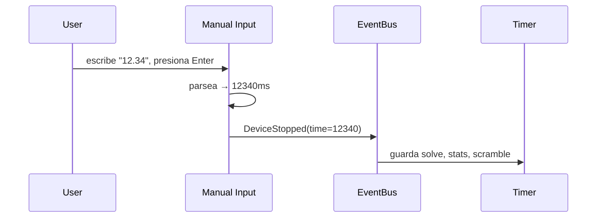
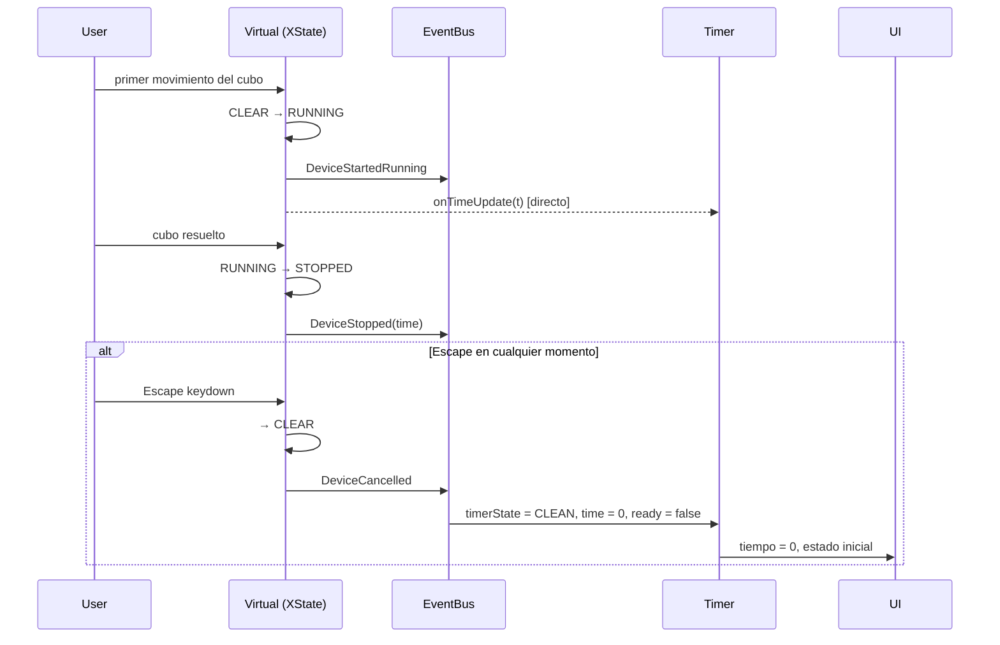
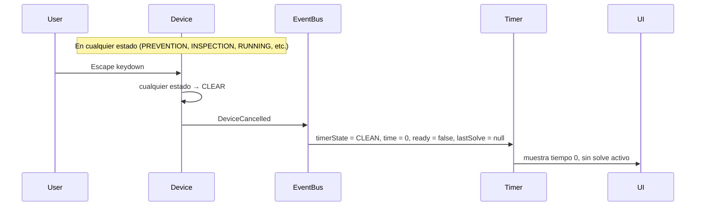
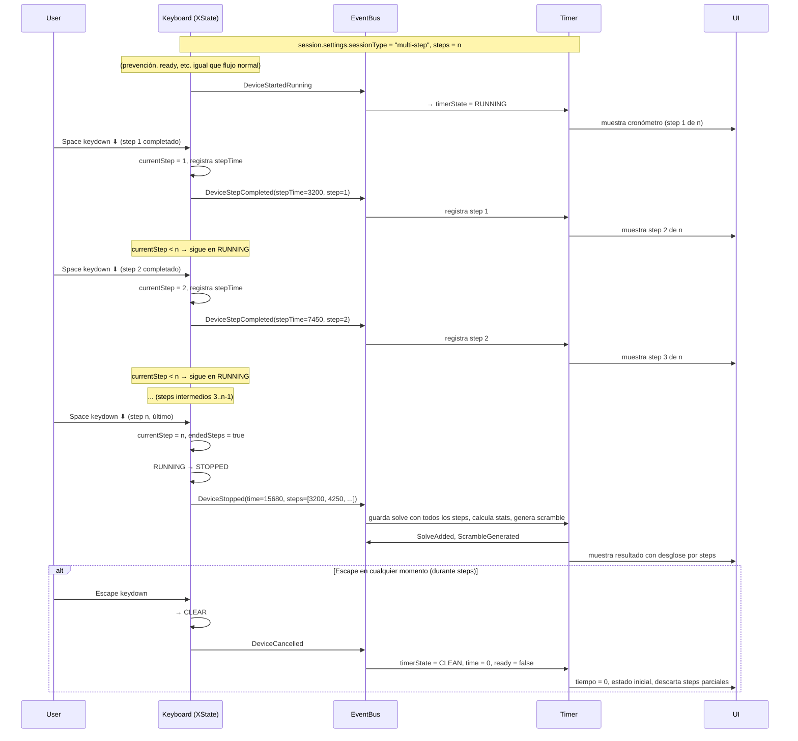
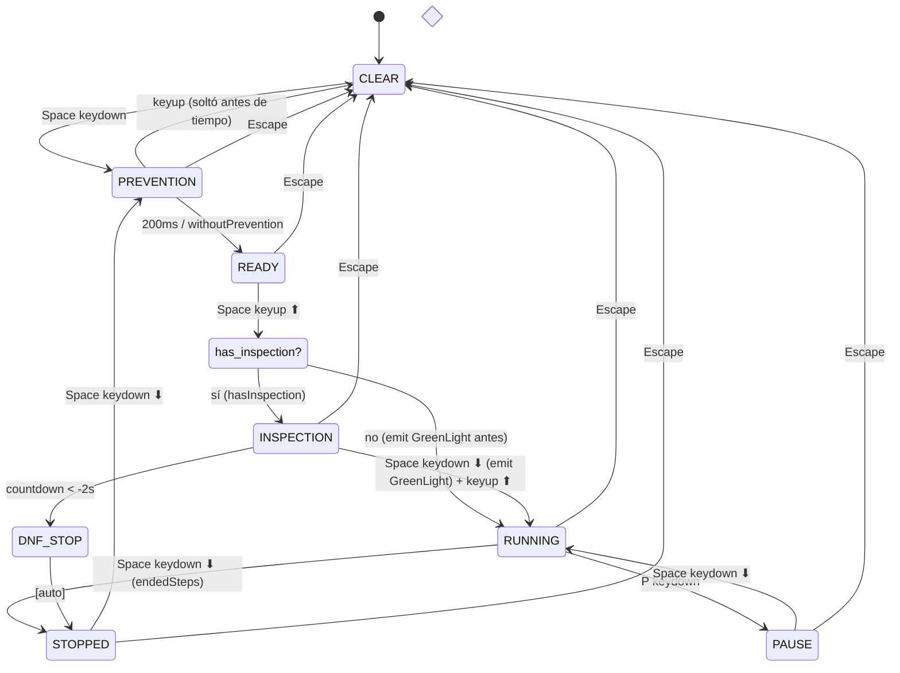

# Timer & Devices: Event-Driven Architecture

## 1. Principio fundamental

```
Device (XState) ── notifica ──▶ EventBus ──▶ Timer (reacciona, muestra, guarda)
```

- El **device** es la autoridad del flujo. Controla transiciones, inspection, prevention, timing.
- El **Timer** es un reactor. Escucha notificaciones y ejecuta side effects.
- El **EventBus** transporta eventos de dominio tipados. No transporta datos de alta frecuencia.
- El **time** (cronómetro/countdown) viaja por un canal directo (callback), no por EventBus.

---

## 2. Flujo de estados

```
CLEAN → PREVENTION → READY → INSPECTION → RUNNING → STOPPED
                                                 ↕
                                               PAUSE
```

- **CLEAN**: estado inicial, sin actividad.
- **PREVENTION**: el usuario mantiene presionado (hold). Detalle del device, el Timer solo muestra.
- **READY**: la prevención terminó. El device puede proceder al siguiente paso.
- **INSPECTION**: countdown de inspección (si aplica). El device lo controla.
- **RUNNING**: cronómetro corriendo.
- **PAUSE**: cronómetro congelado (solo algunos devices lo soportan).
- **STOPPED**: resolución finalizada. El Timer guarda, calcula, genera scramble.

### Flag `ready` vs estado READY

Son conceptos distintos:

- **READY (estado)**: estado de la máquina XState del device, entre PREVENTION e INSPECTION.
  Indica que la prevención terminó y se puede avanzar.
- **`ready` (flag)**: indicador visual ("green light") que se activa **justo antes de RUNNING**.
  La UI lo usa para mostrar el color verde. Se desactiva al entrar a RUNNING o al cancelar.
  - Sin inspección: se activa al salir de READY (inmediatamente antes de RUNNING).
  - Con inspección: se activa cuando el usuario presiona space durante INSPECTION
    (indicando que va a arrancar). No se activa en el estado READY.

### Flujo por device

No todos los devices pasan por todos los estados:
- **Keyboard**: CLEAN → PREVENTION → READY → [INSPECTION →] RUNNING → STOPPED
- **Stackmat**: CLEAN → RUNNING → STOPPED (el hardware controla todo)
- **Manual**: CLEAN → STOPPED (entrada directa de tiempo)
- **Virtual**: CLEAN → RUNNING → STOPPED (primer movimiento inicia)
- **GAN**: CLEAN → RUNNING → STOPPED (similar a virtual)

---

## 3. Timer Input Events (Device → Timer)

Notificaciones que los devices emiten. Son hechos consumados, no solicitudes.

```ts
// src/lib/events/domain/TimerEvents.ts

import type { DomainEvent } from '../types';
import type { Penalty } from '@interfaces';

/**
 * Device notifica que entró en estado de prevención.
 * Timer reacciona: muestra estado PREVENTION en UI.
 */
export class DeviceEnteredPrevention implements DomainEvent {
  readonly type = 'DeviceEnteredPrevention';
  readonly timestamp = Date.now();
  readonly aggregate = 'Timer';

  constructor(public readonly deviceId: string) {}
}

/**
 * Device notifica que la inspección comenzó.
 * Timer reacciona: muestra countdown de inspección en UI.
 */
export class DeviceStartedInspection implements DomainEvent {
  readonly type = 'DeviceStartedInspection';
  readonly timestamp = Date.now();
  readonly aggregate = 'Timer';

  constructor(public readonly deviceId: string) {}
}

/**
 * Device notifica que la prevención terminó.
 * Ocurre entre PREVENTION e INSPECTION.
 * Timer reacciona: prepara el solve (crea lastSolve).
 * NO activa el flag ready. El flag ready se activa por separado, justo antes de RUNNING.
 */
export class DeviceReady implements DomainEvent {
  readonly type = 'DeviceReady';
  readonly timestamp = Date.now();
  readonly aggregate = 'Timer';

  constructor(public readonly deviceId: string) {}
}

/**
 * Device notifica que el usuario está a punto de arrancar (green light).
 * Se emite justo antes de RUNNING:
 *   - Sin inspección: inmediatamente después de READY.
 *   - Con inspección: cuando el usuario presiona space durante INSPECTION.
 * Timer reacciona: activa flag ready=true.
 */
export class DeviceGreenLight implements DomainEvent {
  readonly type = 'DeviceGreenLight';
  readonly timestamp = Date.now();
  readonly aggregate = 'Timer';

  constructor(public readonly deviceId: string) {}
}

/**
 * Device notifica que el cronómetro está corriendo.
 * Timer reacciona: muestra estado RUNNING.
 * El tiempo real se recibe por canal directo (onTimeUpdate), no por EventBus.
 */
export class DeviceStartedRunning implements DomainEvent {
  readonly type = 'DeviceStartedRunning';
  readonly timestamp = Date.now();
  readonly aggregate = 'Timer';

  constructor(public readonly deviceId: string) {}
}

/**
 * Device notifica que el cronómetro se detuvo.
 * Timer reacciona: guarda solve, calcula stats, genera scramble.
 *
 * @param time - Tiempo final en milisegundos.
 *   - Keyboard/Virtual: tiempo medido por el device.
 *   - Stackmat/External: tiempo reportado por el hardware.
 * @param steps - Tiempos parciales para multi-step sessions.
 */
export class DeviceStopped implements DomainEvent {
  readonly type = 'DeviceStopped';
  readonly timestamp = Date.now();
  readonly aggregate = 'Timer';

  constructor(
    public readonly deviceId: string,
    public readonly time: number,
    public readonly steps?: number[],
  ) {}
}

/**
 * Device notifica que se pausó el cronómetro.
 * Timer reacciona: congela la UI.
 */
export class DevicePaused implements DomainEvent {
  readonly type = 'DevicePaused';
  readonly timestamp = Date.now();
  readonly aggregate = 'Timer';

  constructor(public readonly deviceId: string) {}
}

/**
 * Device notifica que se reanudó el cronómetro.
 * Timer reacciona: retoma la UI.
 */
export class DeviceResumed implements DomainEvent {
  readonly type = 'DeviceResumed';
  readonly timestamp = Date.now();
  readonly aggregate = 'Timer';

  constructor(public readonly deviceId: string) {}
}

/**
 * Device notifica que se canceló la resolución.
 * Timer reacciona: reset UI, no guarda nada.
 */
export class DeviceCancelled implements DomainEvent {
  readonly type = 'DeviceCancelled';
  readonly timestamp = Date.now();
  readonly aggregate = 'Timer';

  constructor(public readonly deviceId: string) {}
}

/**
 * Device notifica que la inspección expiró (+2s de gracia).
 * Timer reacciona: guarda solve con DNF.
 *
 * @param fromInspection - Si el DNF fue causado por inspección expirada.
 *   Cuando fromInspection=true, el penalty NO es editable después.
 */
export class DeviceDNF implements DomainEvent {
  readonly type = 'DeviceDNF';
  readonly timestamp = Date.now();
  readonly aggregate = 'Timer';

  constructor(
    public readonly deviceId: string,
    public readonly fromInspection: boolean,
  ) {}
}

/**
 * Device notifica que se aplicó un penalty.
 * Timer reacciona: marca el penalty en el solve actual.
 *
 * Ejemplo: inspección pasa de 15s → P2.
 */
export class DevicePenaltyApplied implements DomainEvent {
  readonly type = 'DevicePenaltyApplied';
  readonly timestamp = Date.now();
  readonly aggregate = 'Timer';

  constructor(
    public readonly deviceId: string,
    public readonly penalty: Penalty,
  ) {}
}

/**
 * Device notifica que se completó un paso intermedio (multi-step).
 * Timer reacciona: registra el step.
 */
export class DeviceStepCompleted implements DomainEvent {
  readonly type = 'DeviceStepCompleted';
  readonly timestamp = Date.now();
  readonly aggregate = 'Timer';

  constructor(
    public readonly deviceId: string,
    public readonly stepTime: number,
    public readonly stepNumber: number,
  ) {}
}

/**
 * Se solicita un nuevo scramble.
 * Puede venir de un device (stackmat reset), de la UI, o del Timer mismo (post-stop).
 */
export class ScrambleRequested implements DomainEvent {
  readonly type = 'ScrambleRequested';
  readonly timestamp = Date.now();
  readonly aggregate = 'Timer';

  constructor(public readonly source: string) {}
}
```

---

## 4. Timer Output Events (Timer → UI/Sistema)

Eventos que el Timer emite después de procesar. La UI y otros sistemas los consumen.

```ts
// Se añaden al mismo archivo o en un archivo separado

/**
 * El Timer cambió de estado visual.
 * UI reacciona: actualiza lo que se muestra.
 */
export class TimerStateChanged implements DomainEvent {
  readonly type = 'TimerStateChanged';
  readonly timestamp = Date.now();
  readonly aggregate = 'Timer';

  constructor(
    public readonly previousState: TimerState,
    public readonly newState: TimerState,
  ) {}
}

/**
 * Se generó un nuevo scramble.
 * UI reacciona: muestra el nuevo scramble e imagen.
 */
export class ScrambleGenerated implements DomainEvent {
  readonly type = 'ScrambleGenerated';
  readonly timestamp = Date.now();
  readonly aggregate = 'Timer';

  constructor(public readonly scramble: string) {}
}

/**
 * Se alcanzó un nuevo récord.
 * UI reacciona: confetti, notificación.
 */
export class NewRecord implements DomainEvent {
  readonly type = 'NewRecord';
  readonly timestamp = Date.now();
  readonly aggregate = 'Timer';

  constructor(
    public readonly records: Array<{
      name: string;
      previous: number;
      current: number;
    }>,
  ) {}
}

/**
 * Se debe mostrar una celebración.
 */
export class CelebrationTriggered implements DomainEvent {
  readonly type = 'CelebrationTriggered';
  readonly timestamp = Date.now();
  readonly aggregate = 'Timer';

  constructor(
    public readonly records: Array<{
      name: string;
      previous: number;
      current: number;
    }>,
  ) {}
}

// SolveAdded, SolveUpdated, SolvesRemoved ya existen en SolveEvents.ts
// ScrambleGenerated se usa en lugar de emitir el scramble directamente
```

---

## 5. Canal de tiempo (alta frecuencia)

El tiempo del cronómetro y el countdown de inspección NO pasan por el EventBus.
Se usa un callback directo que el Timer provee al device al momento del binding.

```ts
/**
 * Canal de alta frecuencia para actualizaciones de tiempo.
 * El device llama a este callback ~100 veces/segundo.
 * El Timer lo conecta internamente al store reactivo de la UI.
 */
type TimeUpdateCallback = (time: number) => void;
```

---

## 6. Device Binding

Cómo se conecta un device al Timer.

```ts
import type { Readable } from 'svelte/store';

/**
 * Vista de solo lectura que el Timer provee al device.
 * El device puede leer estos valores pero no modificarlos.
 */
interface TimerReadonlyView {
  readonly scramble: Readable<string>;
  readonly state: Readable<TimerState>;
  readonly session: Readable<Session>;
}

/**
 * Contexto que recibe el device al inicializarse.
 * Reemplaza al actual InputContext.
 */
interface DeviceContext {
  /** Vista de solo lectura del Timer */
  timer: TimerReadonlyView;

  /** EventBus para emitir notificaciones al Timer */
  eventBus: IEventBus;

  /** Callback para actualizaciones de tiempo de alta frecuencia */
  onTimeUpdate: TimeUpdateCallback;

  /** ID único del device */
  deviceId: string;
}
```

---

## 7. Interfaz base del Device

```ts
interface ITimerDevice {
  readonly type: string;
  readonly id: string;
  name: string;
  enabled: boolean;

  /** Inicializa el device con el contexto del Timer */
  init(context: DeviceContext): void;

  /** Desconecta el device y limpia recursos */
  disconnect(): void;

  /** Serialización para persistencia */
  toJSON(): Record<string, any>;
  fromJSON(config: Record<string, any>): void;
}

/** Devices que responden a eventos de teclado */
interface IKeyboardDevice extends ITimerDevice {
  keyUpHandler(ev: KeyboardEvent): void;
  keyDownHandler(ev: KeyboardEvent): void;
}

/** Devices que se conectan por Bluetooth */
interface IBluetoothDevice extends ITimerDevice {
  isConnected: boolean;
  connect(): Promise<void>;
}

/** Devices que usan audio (stackmat) */
interface IAudioDevice extends ITimerDevice {
  isConnected: boolean;
}
```

---

## 8. Timer: reacciones a eventos

Lo que el Timer hace cuando recibe cada evento.

```ts
// Pseudocódigo de las suscripciones del Timer

class TimerReactor {
  constructor(private eventBus: IEventBus, private controller: TimerController) {
    this.setupSubscriptions();
  }

  private setupSubscriptions() {
    // === Flujo del solve ===

    eventBus.subscribe(DeviceEnteredPrevention, (e) => {
      controller.timerState.set(TimerState.PREVENTION);
      controller.time.set(0);       // reset tiempo en pantalla
      controller.decimals.set(true);
      controller.ready.set(false);
    });

    eventBus.subscribe(DeviceStartedInspection, (e) => {
      controller.timerState.set(TimerState.INSPECTION);
      controller.decimals.set(false);
    });

    eventBus.subscribe(DeviceReady, (e) => {
      controller.createNewSolve();
    });

    eventBus.subscribe(DeviceGreenLight, (e) => {
      controller.ready.set(true);  // green light on
    });

    eventBus.subscribe(DeviceStartedRunning, (e) => {
      controller.timerState.set(TimerState.RUNNING);
      controller.decimals.set(true);
      controller.ready.set(false); // green light off
    });

    eventBus.subscribe(DeviceStopped, (e) => {
      controller.timerState.set(TimerState.STOPPED);
      controller.time.set(e.time);

      // Side effects
      controller.addSolve(e.time, penalty, e.steps);
      controller.initScrambler(...);
      controller.updateStatistics(true);
    });

    eventBus.subscribe(DevicePaused, (e) => {
      controller.timerState.set(TimerState.PAUSE);
    });

    eventBus.subscribe(DeviceResumed, (e) => {
      controller.timerState.set(TimerState.RUNNING);
    });

    eventBus.subscribe(DeviceCancelled, (e) => {
      controller.timerState.set(TimerState.CLEAN);
      controller.time.set(0);
      controller.ready.set(false);
      controller.lastSolve.set(null);
    });

    // === Penalties ===

    eventBus.subscribe(DevicePenaltyApplied, (e) => {
      const solve = get(controller.lastSolve);
      if (solve) {
        solve.penalty = e.penalty;
        controller.lastSolve.set(solve);
      }
    });

    eventBus.subscribe(DeviceDNF, (e) => {
      controller.addSolve(Infinity, Penalty.DNF);
    });

    // === Scramble ===

    eventBus.subscribe(ScrambleRequested, (e) => {
      controller.initScrambler(...);
    });
  }
}
```

---

## 9. Diagramas de flujo por device

### 9.1 Keyboard (sin inspección)



### 9.2 Keyboard (con inspección)



### 9.3 Stackmat



### 9.4 Manual entry



### 9.5 Virtual cube



### 9.6 Cancel (cualquier device con teclado)



### 9.7 Multi-step (n pasos)



---

## 10. Diagrama de estado: Keyboard Device (XState corregido)



### Flag `ready` (green light) en el diagrama

El flag `ready=true` se activa por `DeviceGreenLight`, que se emite:
- **Sin inspección**: al entrar a READY (justo antes de RUNNING). El Space sigue presionado desde PREVENTION.
- **Con inspección**: al presionar Space keydown ⬇ **durante** INSPECTION. El usuario sostiene Space y al soltar (keyup ⬆) pasa a RUNNING.

En ambos casos, `ready=false` se desactiva al entrar a RUNNING o al cancelar con Escape.

---

## 11. Responsabilidades

| Componente | Hace | NO hace |
|---|---|---|
| **Device** | Controla el flujo de estados. Mide el tiempo. Maneja inspection/prevention. Emite eventos al EventBus. | Guardar solves. Modificar scramble. Calcular stats. Escribir en stores del Timer (excepto time via callback). |
| **Timer** | Reacciona a eventos. Actualiza la UI. Guarda solves en DB. Calcula estadísticas. Genera scrambles. Emite celebrations. | Decidir transiciones de estado. Controlar el flujo del solve. Conocer detalles del hardware. |
| **EventBus** | Transporta eventos tipados entre componentes. | Lógica de negocio. Almacenar estado. Transportar datos de alta frecuencia. |

---

## 12. Acceso a datos

```
Device puede LEER (via TimerReadonlyView):
  ├── scramble         → para mostrar o enviar al hardware
  ├── session.settings → para saber si hay inspection, prevention, steps, etc.
  └── state            → para sincronizar si es necesario

Device puede ESCRIBIR (via canales directos):
  └── time             → via onTimeUpdate callback (alta frecuencia)

Device EMITE (via EventBus):
  └── Eventos de dominio (DeviceStopped, DeviceReady, etc.)

Timer REACCIONA (via EventBus subscriptions):
  ├── Actualiza stores internos (timerState, ready, solves, stats, etc.)
  ├── Guarda en DB
  ├── Genera scrambles
  └── Emite eventos de salida (SolveAdded, NewRecord, etc.)
```

---

## 13. Orden de migración

1. Crear `TimerEvents.ts` con todos los eventos definidos aquí.
2. Crear `TimerReactor` que suscriba el Timer a los eventos de input.
3. Migrar **Keyboard** device: reemplazar manipulación directa de stores por emisión de eventos + onTimeUpdate callback.
4. Migrar **Manual** device.
5. Migrar **Stackmat** device.
6. Migrar **Virtual** device.
7. Migrar **GAN** device.
8. Eliminar `InputContext` viejo.
9. Eliminar `Emitter` viejo.
10. Separar TimerController en sub-servicios si se desea (ScrambleService, StatsService, CelebrationService).
