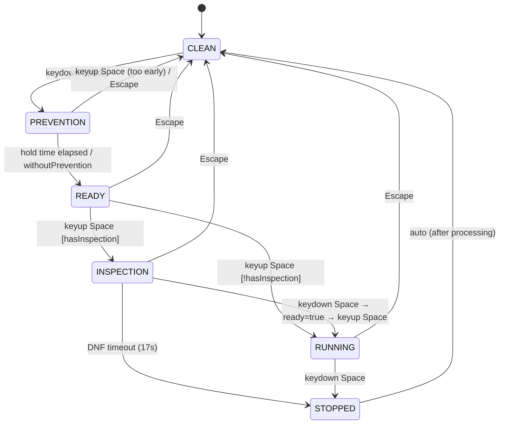

# Devices Architecture

## Principle

Devices are **autonomous translators** between hardware/physical input and the Timer.
Each device maintains its own state machine (XState) and emits events to the EventBus.
The Timer reacts to those events without knowing the device details.

```
Hardware/Input → Device (XState) → EventBus → Timer (reactor)
                                  ← EventBus ← Timer (feedback: scramble, records)
```

---

## Device Catalog

| Device | Type | Input | Connection | Discovery |
|---|---|---|---|---|
| **Keyboard** | `timer_keyboard` | KeyboardEvent | Always available | N/A |
| **Manual** | `manual_entry` | Text (numeric input) | Always available | N/A |
| **Virtual** | `virtual_cube_keyboard` | KeyboardEvent (moves) | Always available | N/A |
| **Stackmat** | `stackmat` | Audio (mic/line-in) | On-demand | Web Audio API |
| **GAN iCarry** | `gan_icarry` | Bluetooth GATT | On-demand | Web Bluetooth / Electron BLE |
| **QY-Timer** | `qiyi_smart_timer` | Bluetooth GATT | On-demand | Web Bluetooth / Electron BLE |
| **External** | `network_timer` | Socket.io | On-demand | Manual (IP:port) |
| **USB Timer** | `usb_timer` | USB serial | On-demand | Electron only |

### Categories

- **Always available**: Keyboard, Manual, Virtual. No connection required.
- **On-demand**: Require explicit discovery and connection.

---

## IDevice Interface (Target)

```ts
interface IDevice {
  /** Unique type identifier */
  readonly type: DeviceType;

  /** Instance ID (for multiple devices of the same type) */
  readonly id: string;

  /** Display name */
  name: string;

  /** Connection state */
  readonly isConnected: boolean;

  /** Whether the device is enabled for the current session */
  enabled: boolean;

  /**
   * Initializes the device.
   * Subscribes to EventBus and starts the internal state machine.
   * @param eventBus - Bus for emitting events to the Timer
   * @param config - Persisted device configuration
   */
  init(eventBus: IEventBus, config?: DeviceConfig): void;

  /**
   * Disconnects and cleans up resources.
   */
  disconnect(): void;

  /**
   * Serializes the persistable configuration.
   */
  toJSON(): DeviceConfig;

  /**
   * Restores from persisted configuration.
   */
  fromJSON(config: DeviceConfig): void;
}
```

### Specialized Interfaces

```ts
/** Devices that read from the keyboard */
interface IKeyboardDevice extends IDevice {
  type: 'timer_keyboard' | 'virtual_cube_keyboard';
  onKeyDown(e: KeyboardEvent): void;
  onKeyUp(e: KeyboardEvent): void;
}

/** Bluetooth devices */
interface IBluetoothDevice extends IDevice {
  type: 'gan_icarry' | 'qiyi_smart_timer';
  readonly batteryLevel: number;
  readonly hardwareVersion: string;
  readonly softwareVersion: string;

  /** Starts scanning and connection */
  discover(): Promise<void>;

  /** Reconnects to a previously paired device */
  reconnect(address: string): Promise<void>;
}

/** Audio devices */
interface IAudioDevice extends IDevice {
  type: 'stackmat';
  readonly signalQuality: number;

  /** Requests microphone access */
  requestAudioAccess(): Promise<void>;
}

/** Network devices */
interface INetworkDevice extends IDevice {
  type: 'network_timer';
  readonly ipAddress: string;
  readonly port: number;

  connect(ip: string, port: number): Promise<void>;
}
```

---

## Platform-Specific Discovery

Discovery of on-demand devices differs between Web and Electron.

```ts
interface IDeviceDiscovery {
  /**
   * Scans for available devices of the requested type.
   * @returns List of found devices (not yet connected).
   */
  scan(type: DeviceType): Promise<IDiscoveredDevice[]>;

  /** Indicates if this platform supports the device type */
  supports(type: DeviceType): boolean;
}

interface IDiscoveredDevice {
  type: DeviceType;
  name: string;
  address: string; // Bluetooth MAC, IP:port, USB port, etc.
}
```

### Web

```ts
class WebDeviceDiscovery implements IDeviceDiscovery {
  supports(type: DeviceType): boolean {
    // Bluetooth: navigator.bluetooth available
    // Stackmat: navigator.mediaDevices available
    // USB: NOT supported on web
    // Network: supported via WebSocket
  }

  async scan(type: DeviceType): Promise<IDiscoveredDevice[]> {
    switch (type) {
      case 'gan_icarry':
      case 'qiyi_smart_timer':
        // navigator.bluetooth.requestDevice({ filters: [...] })
        break;
      case 'stackmat':
        // navigator.mediaDevices.getUserMedia({ audio: true })
        break;
    }
  }
}
```

### Electron

```ts
class ElectronDeviceDiscovery implements IDeviceDiscovery {
  supports(type: DeviceType): boolean {
    // All types supported
    // Bluetooth: via noble or @electron/bluetooth
    // USB: via serialport
    // etc.
  }

  async scan(type: DeviceType): Promise<IDiscoveredDevice[]> {
    // IPC to main process for native scanning
  }
}
```

### Environment Selection

```ts
function createDeviceDiscovery(): IDeviceDiscovery {
  if (isElectron()) return new ElectronDeviceDiscovery();
  return new WebDeviceDiscovery();
}
```

---

## Device-Session Compatibility

Not all devices make sense for all sessions.
The list of available devices is filtered by the active session:

```ts
function getCompatibleDevices(
  session: ISession,
  allDevices: IDevice[],
): IDevice[] {
  const mode = session.settings.mode; // e.g., '333', '444', 'pyram'

  return allDevices.filter(device => {
    switch (device.type) {
      case 'timer_keyboard':
      case 'manual_entry':
      case 'stackmat':
        return true; // compatible with any session

      case 'gan_icarry':
        return mode === '333'; // GAN iCarry is a 3x3 cube

      case 'qiyi_smart_timer':
        return true; // it's a timer, not a cube

      case 'virtual_cube_keyboard':
        return isVirtualCompatible(mode); // only puzzles with simulator

      default:
        return true;
    }
  });
}
```

---

## Lifecycle


### Always Available (Keyboard, Manual, Virtual)

They skip directly from `Registered → Active` because they don't need discovery.

---

## DeviceManager Coordination

DeviceManager is a **singleton service** that coordinates device-session binding.

### Responsibilities

1. **Registry**: Maintain list of all devices (connected and disconnected)
2. **Session-Device Binding**: Track which device is active for each session
3. **Compatibility Checking**: Filter devices by session requirements
4. **Automatic Fallback**: If active device becomes incompatible, fallback to Keyboard
5. **Lifecycle**: Initialize devices, handle disconnects, cleanup

### Event Listening

DeviceManager listens to:

**1. SessionSwitched event**
```ts
eventBus.subscribe(SessionSwitched, async (event) => {
  const { newSessionId } = event;
  
  // Get the new session
  const newSession = await sessionRepository.get(newSessionId);
  
  // Get current active device for this session (if any)
  const currentDevice = deviceManager.getDeviceForSession(newSessionId);
  
  // Check if current device is still compatible
  if (currentDevice && !isCompatible(currentDevice, newSession)) {
    // Find a compatible device
    const compatibleDevices = getCompatibleDevices(newSession, allDevices);
    
    if (compatibleDevices.length > 0) {
      // Use first compatible
      await selectDevice(compatibleDevices[0], newSession);
    } else {
      // Fallback to Keyboard (always compatible)
      await selectDevice(getKeyboardDevice(), newSession);
    }
  }
});
```

**2. DeviceDisconnected event**
```ts
eventBus.subscribe(DeviceDisconnected, async (event) => {
  const { deviceId, reason } = event;
  
  // If this was the active device for any session, fallback to Keyboard
  for (const session of allSessions) {
    if (session.settings.device === deviceId) {
      await selectDevice(getKeyboardDevice(), session);
    }
  }
});
```

**3. SessionSettingsChanged event** (device preference)
```ts
eventBus.subscribe(SessionSettingsChanged, async (event) => {
  // If device preference changed, re-validate compatibility
  // Usually user won't select incompatible device (UI filters it)
  // But handle if somehow they do
});
```

### Fallback Behavior

```
Session switches to mode 333
├─ Current active device: "GAN iCarry" (only 3x3)
├─ New session mode: 222
├─ Compatibility check: GAN iCarry incompatible with 222
│
└─ Fallback sequence:
   1. Get all compatible devices for 222
   2. If any exist: select first
   3. If none: select Keyboard (always compatible)
   4. Emit ActiveDeviceChanged with new device
```

### Keyboard Guarantee

**Keyboard is always available and compatible**:
- No discovery needed
- No connection required
- Works with any puzzle mode
- Acts as ultimate fallback

---

## Device Management Events

```ts
/** A new device was discovered */
export class DeviceDiscovered implements IDomainEvent {
  readonly type = 'DeviceDiscovered';
  readonly timestamp = Date.now();
  constructor(
    public readonly device: IDiscoveredDevice,
  ) {}
}

/** Device connected successfully */
export class DeviceConnected implements IDomainEvent {
  readonly type = 'DeviceConnected';
  readonly timestamp = Date.now();
  constructor(
    public readonly deviceId: string,
    public readonly deviceType: DeviceType,
  ) {}
}

/** Device disconnected (voluntary or involuntary) */
export class DeviceDisconnected implements IDomainEvent {
  readonly type = 'DeviceDisconnected';
  readonly timestamp = Date.now();
  constructor(
    public readonly deviceId: string,
    public readonly reason: 'user' | 'hardware' | 'error',
  ) {}
}

/** The active device for the session was changed */
export class ActiveDeviceChanged implements IDomainEvent {
  readonly type = 'ActiveDeviceChanged';
  readonly timestamp = Date.now();
  constructor(
    public readonly deviceId: string,
    public readonly sessionId: string,
  ) {}
}
```

---

## Internal XState (Keyboard Example)

XState is kept **inside** the device. The Timer never sees the state machine.
What the Timer sees are the events the device emits to the EventBus.



Each transition emits the corresponding event to the EventBus:
- `CLEAN → PREVENTION`: emits `DeviceEnteredPrevention`
- `PREVENTION → READY`: emits `DeviceReady`
- `READY → RUNNING`: emits `DeviceStartedRunning`
- etc.

---

## Time Channel (onTimeUpdate)

High-frequency time (~60-100 updates/s) does NOT travel through EventBus.
A direct callback is used, which the Timer provides to the device:

```ts
type OnTimeUpdate = (time: number) => void;

// Timer passes the callback to the device
device.init(eventBus, config);
device.setTimeCallback((time: number) => {
  timerState.time = time; // updates $state directly
});
```

This applies to both:
- Running stopwatch (Keyboard, Virtual)
- Inspection countdown (Keyboard)
- Hardware time (Stackmat, QY-Timer)
