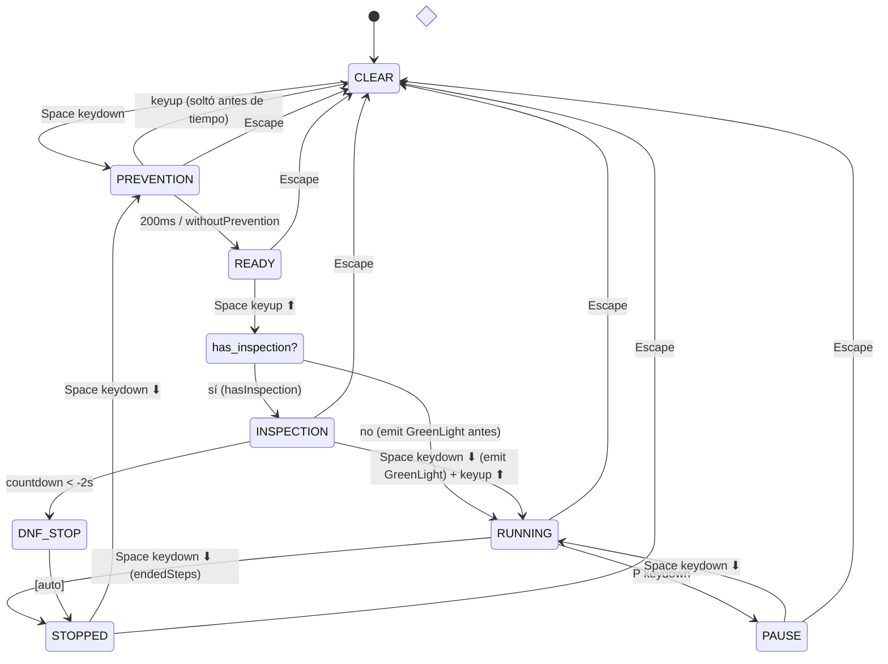
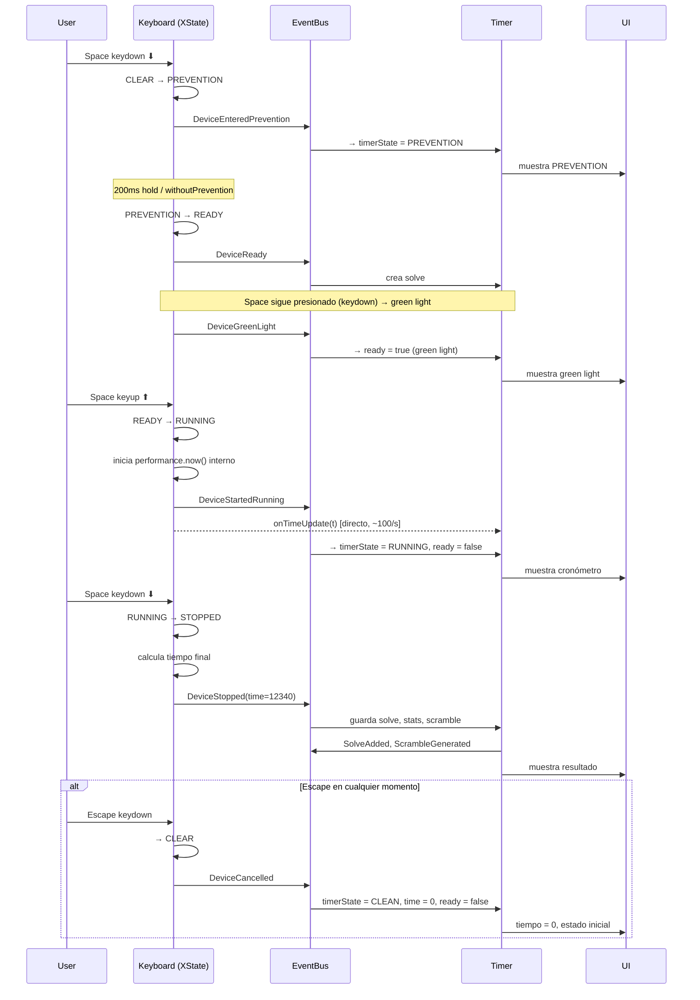
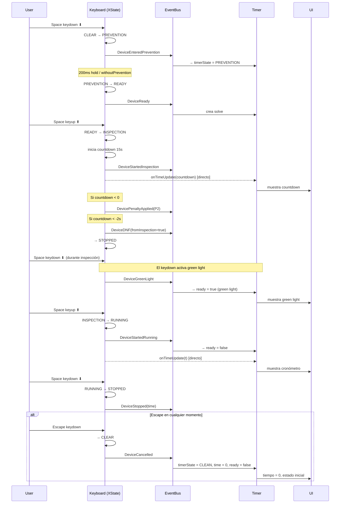
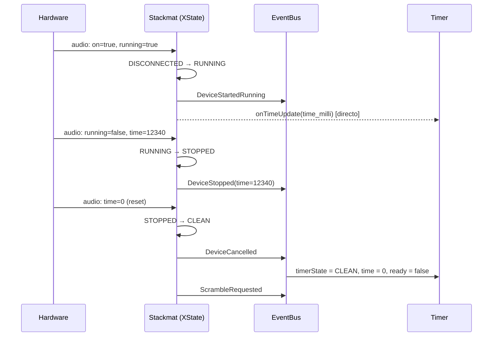
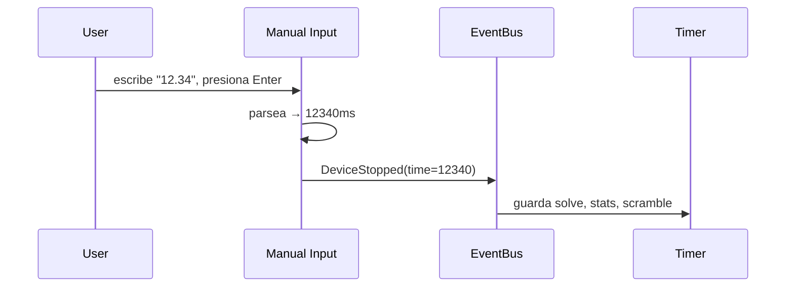
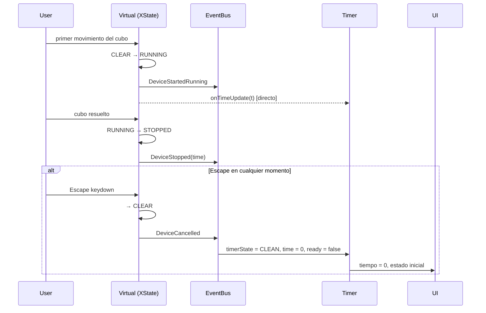
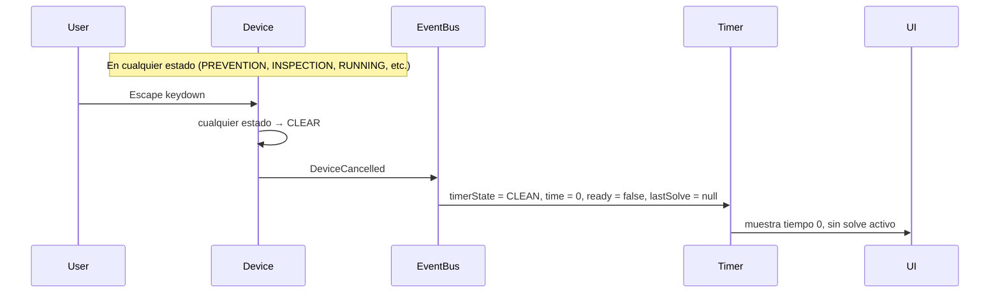
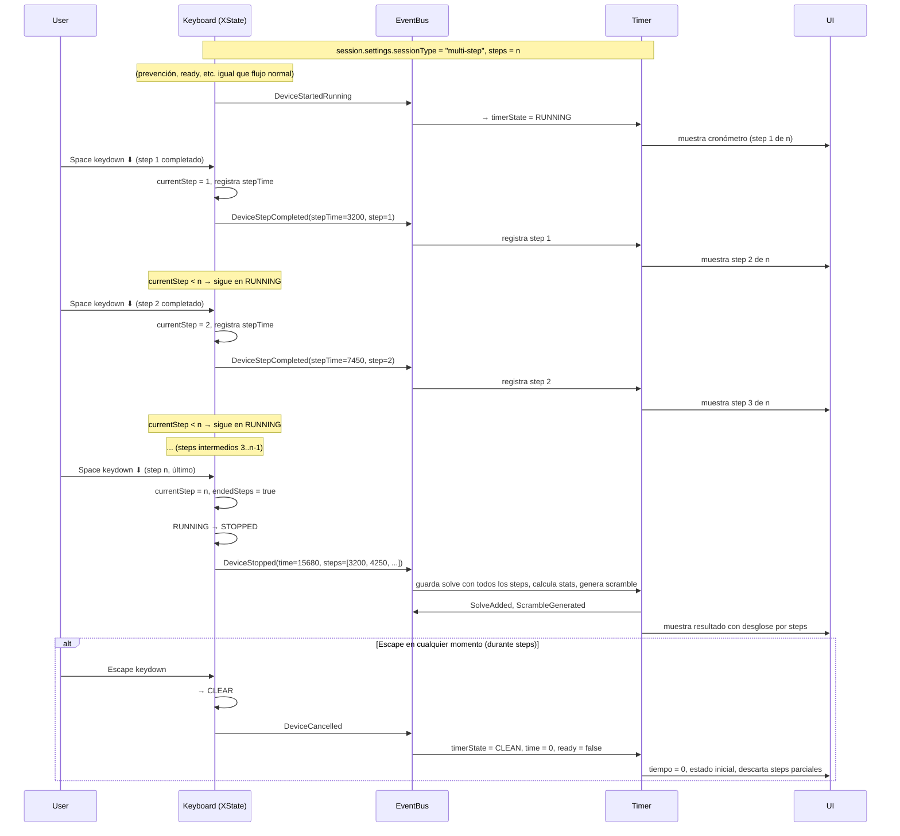

# Devices

## Device Binding

Cómo se conecta un device al Timer.

```ts
import type { Readable } from 'svelte/store';

/**
 * Vista de solo lectura que el Timer provee al device.
 * El device puede leer estos valores pero no modificarlos.
 */
interface TimerReadonlyView {
  readonly scramble: Readable<string>;
  readonly state: Readable<TimerState>;
  readonly session: Readable<Session>;
}

/**
 * Contexto que recibe el device al inicializarse.
 * Reemplaza al actual InputContext.
 */
interface DeviceContext {
  /** Vista de solo lectura del Timer */
  timer: TimerReadonlyView;

  /** EventBus para emitir notificaciones al Timer */
  eventBus: IEventBus;

  /** Callback para actualizaciones de tiempo de alta frecuencia */
  onTimeUpdate: TimeUpdateCallback;

  /** ID único del device */
  deviceId: string;
}
```

## Interfaz base del Device

```ts
interface ITimerDevice {
  readonly type: string;
  readonly id: string;
  name: string;
  enabled: boolean;

  /** Inicializa el device con el contexto del Timer */
  init(context: DeviceContext): void;

  /** Desconecta el device y limpia recursos */
  disconnect(): void;

  /** Serialización para persistencia */
  toJSON(): Record<string, any>;
  fromJSON(config: Record<string, any>): void;
}

/** Devices que responden a eventos de teclado */
interface IKeyboardDevice extends ITimerDevice {
  keyUpHandler(ev: KeyboardEvent): void;
  keyDownHandler(ev: KeyboardEvent): void;
}

/** Devices que se conectan por Bluetooth */
interface IBluetoothDevice extends ITimerDevice {
  isConnected: boolean;
  connect(): Promise<void>;
}

/** Devices que usan audio (stackmat) */
interface IAudioDevice extends ITimerDevice {
  isConnected: boolean;
}
```

## Filtrado de devices por sesión

La lista de devices disponibles para una sesión se filtra por compatibilidad
entre el device y el tipo de puzzle/mode de la sesión.

```ts
/**
 * Determina si un device es compatible con una sesión.
 * Ejemplo: GAN iCarry solo es compatible con sesiones de 3x3.
 */
function isDeviceCompatible(device: ITimerDevice, session: Session): boolean {
  // Keyboard y Manual siempre son compatibles
  if (device.type === 'timer_keyboard' || device.type === 'manual_entry') return true;

  // Stackmat siempre compatible (mide tiempo, no el puzzle)
  if (device.type === 'stackmat') return true;

  // GAN iCarry: solo 3x3
  if (device.type === 'gan_icarry') {
    return session.settings.mode === '333' || session.settings.sessionType === 'mixed';
  }

  // Virtual keyboard: depende del puzzle soportado
  if (device.type === 'virtual_cube_keyboard') {
    return true; // por ahora
  }

  return true;
}
```

## Diagrama de estado: Keyboard Device (XState)



### Flag `ready` (green light) en el diagrama

El flag `ready=true` se activa por `DeviceGreenLight`, que se emite:
- **Sin inspección**: al entrar a READY (justo antes de RUNNING). El Space sigue presionado desde PREVENTION.
- **Con inspección**: al presionar Space keydown ⬇ **durante** INSPECTION. El usuario sostiene Space y al soltar (keyup ⬆) pasa a RUNNING.

En ambos casos, `ready=false` se desactiva al entrar a RUNNING o al cancelar con Escape.

## Diagramas de flujo por device

### Keyboard (sin inspección)



### Keyboard (con inspección)



### Stackmat



### Manual entry



### Virtual cube



### Cancel (cualquier device con teclado)



### Multi-step (n pasos)


