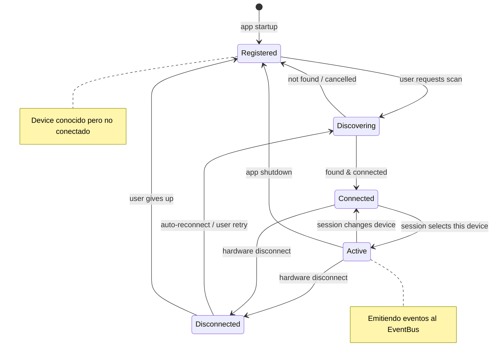
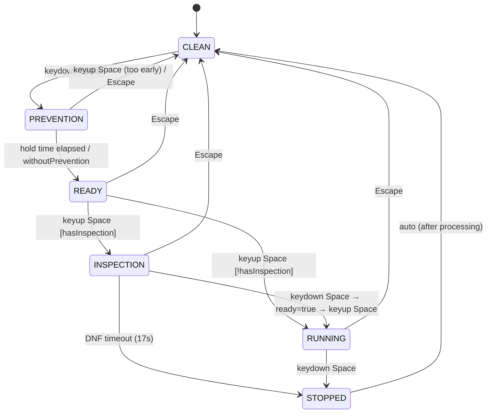

# Devices Architecture

## Principio

Los devices son **traductores autónomos** entre hardware/input físico y el Timer.
Cada device mantiene su propia máquina de estados (XState) y emite eventos al EventBus.
El Timer reacciona a esos eventos sin conocer los detalles del device.

```
Hardware/Input → Device (XState) → EventBus → Timer (reactor)
                                  ← EventBus ← Timer (feedback: scramble, records)
```

---

## Catálogo de devices

| Device | Tipo | Input | Conexión | Descubrimiento |
|---|---|---|---|---|
| **Keyboard** | `timer_keyboard` | KeyboardEvent | Siempre disponible | N/A |
| **Manual** | `manual_entry` | Texto (input numérico) | Siempre disponible | N/A |
| **Virtual** | `virtual_cube_keyboard` | KeyboardEvent (movimientos) | Siempre disponible | N/A |
| **Stackmat** | `stackmat` | Audio (mic/line-in) | On-demand | Web Audio API |
| **GAN iCarry** | `gan_icarry` | Bluetooth GATT | On-demand | Web Bluetooth / Electron BLE |
| **QY-Timer** | `qiyi_smart_timer` | Bluetooth GATT | On-demand | Web Bluetooth / Electron BLE |
| **External** | `network_timer` | Socket.io | On-demand | Manual (IP:port) |
| **USB Timer** | `usb_timer` | USB serial | On-demand | Electron only |

### Categorías

- **Siempre disponibles**: Keyboard, Manual, Virtual. No requieren conexión.
- **On-demand**: Requieren descubrimiento y conexión explícita.

---

## IDevice Interface (target)

```ts
interface IDevice {
  /** Identificador único del tipo */
  readonly type: DeviceType;

  /** ID de instancia (para múltiples devices del mismo tipo) */
  readonly id: string;

  /** Nombre visible */
  name: string;

  /** Estado de conexión */
  readonly isConnected: boolean;

  /** Si el device está habilitado para la sesión actual */
  enabled: boolean;

  /**
   * Inicializa el device.
   * Suscribe al EventBus y arranca la máquina de estados interna.
   * @param eventBus - Bus para emitir eventos al Timer
   * @param config - Configuración persistida del device
   */
  init(eventBus: IEventBus, config?: DeviceConfig): void;

  /**
   * Desconecta y limpia recursos.
   */
  disconnect(): void;

  /**
   * Serializa la configuración persistible.
   */
  toJSON(): DeviceConfig;

  /**
   * Restaura desde configuración persistida.
   */
  fromJSON(config: DeviceConfig): void;
}
```

### Interfaces especializadas

```ts
/** Devices que leen del teclado */
interface IKeyboardDevice extends IDevice {
  type: 'timer_keyboard' | 'virtual_cube_keyboard';
  onKeyDown(e: KeyboardEvent): void;
  onKeyUp(e: KeyboardEvent): void;
}

/** Devices Bluetooth */
interface IBluetoothDevice extends IDevice {
  type: 'gan_icarry' | 'qiyi_smart_timer';
  readonly batteryLevel: number;
  readonly hardwareVersion: string;
  readonly softwareVersion: string;

  /** Inicia escaneo y conexión */
  discover(): Promise<void>;

  /** Reconecta a un device previamente pareado */
  reconnect(address: string): Promise<void>;
}

/** Devices de audio */
interface IAudioDevice extends IDevice {
  type: 'stackmat';
  readonly signalQuality: number;

  /** Solicita acceso al micrófono */
  requestAudioAccess(): Promise<void>;
}

/** Devices de red */
interface INetworkDevice extends IDevice {
  type: 'network_timer';
  readonly ipAddress: string;
  readonly port: number;

  connect(ip: string, port: number): Promise<void>;
}
```

---

## Descubrimiento por plataforma

El descubrimiento de devices on-demand difiere entre Web y Electron.

```ts
interface IDeviceDiscovery {
  /**
   * Escanea devices disponibles del tipo solicitado.
   * @returns Lista de devices encontrados (no conectados aún).
   */
  scan(type: DeviceType): Promise<IDiscoveredDevice[]>;

  /** Indica si esta plataforma soporta el tipo de device */
  supports(type: DeviceType): boolean;
}

interface IDiscoveredDevice {
  type: DeviceType;
  name: string;
  address: string; // Bluetooth MAC, IP:port, USB port, etc.
}
```

### Web

```ts
class WebDeviceDiscovery implements IDeviceDiscovery {
  supports(type: DeviceType): boolean {
    // Bluetooth: navigator.bluetooth disponible
    // Stackmat: navigator.mediaDevices disponible
    // USB: NO soportado en web
    // Network: soportado via WebSocket
  }

  async scan(type: DeviceType): Promise<IDiscoveredDevice[]> {
    switch (type) {
      case 'gan_icarry':
      case 'qiyi_smart_timer':
        // navigator.bluetooth.requestDevice({ filters: [...] })
        break;
      case 'stackmat':
        // navigator.mediaDevices.getUserMedia({ audio: true })
        break;
    }
  }
}
```

### Electron

```ts
class ElectronDeviceDiscovery implements IDeviceDiscovery {
  supports(type: DeviceType): boolean {
    // Todos los tipos soportados
    // Bluetooth: via noble o @electron/bluetooth
    // USB: via serialport
    // etc.
  }

  async scan(type: DeviceType): Promise<IDiscoveredDevice[]> {
    // IPC al proceso main para escaneo nativo
  }
}
```

### Selección por ambiente

```ts
function createDeviceDiscovery(): IDeviceDiscovery {
  if (isElectron()) return new ElectronDeviceDiscovery();
  return new WebDeviceDiscovery();
}
```

---

## Compatibilidad device-sesión

No todos los devices tienen sentido para todas las sesiones.
La lista de devices disponibles se filtra por la sesión activa:

```ts
function getCompatibleDevices(
  session: ISession,
  allDevices: IDevice[],
): IDevice[] {
  const mode = session.settings.mode; // e.g., '333', '444', 'pyram'

  return allDevices.filter(device => {
    switch (device.type) {
      case 'timer_keyboard':
      case 'manual_entry':
      case 'stackmat':
        return true; // compatibles con cualquier sesión

      case 'gan_icarry':
        return mode === '333'; // GAN iCarry es un cubo 3x3

      case 'qiyi_smart_timer':
        return true; // es un timer, no un cubo

      case 'virtual_cube_keyboard':
        return isVirtualCompatible(mode); // solo puzzles con simulador

      default:
        return true;
    }
  });
}
```

---

## Ciclo de vida



### Siempre disponibles (Keyboard, Manual, Virtual)

Saltan directamente de `Registered → Active` porque no necesitan descubrimiento.

---

## Eventos de device management

```ts
/** Se descubrió un nuevo device */
export class DeviceDiscovered implements IDomainEvent {
  readonly type = 'DeviceDiscovered';
  readonly timestamp = Date.now();
  constructor(
    public readonly device: IDiscoveredDevice,
  ) {}
}

/** Device conectado exitosamente */
export class DeviceConnected implements IDomainEvent {
  readonly type = 'DeviceConnected';
  readonly timestamp = Date.now();
  constructor(
    public readonly deviceId: string,
    public readonly deviceType: DeviceType,
  ) {}
}

/** Device desconectado (voluntario o involuntario) */
export class DeviceDisconnected implements IDomainEvent {
  readonly type = 'DeviceDisconnected';
  readonly timestamp = Date.now();
  constructor(
    public readonly deviceId: string,
    public readonly reason: 'user' | 'hardware' | 'error',
  ) {}
}

/** Se cambió el device activo para la sesión */
export class ActiveDeviceChanged implements IDomainEvent {
  readonly type = 'ActiveDeviceChanged';
  readonly timestamp = Date.now();
  constructor(
    public readonly deviceId: string,
    public readonly sessionId: string,
  ) {}
}
```

---

## XState interno (ejemplo Keyboard)

El XState se mantiene **dentro** del device. El Timer nunca ve la máquina de estados.
Lo que el Timer ve son los eventos que el device emite al EventBus.



Cada transición emite el evento correspondiente al EventBus:
- `CLEAN → PREVENTION`: emite `DeviceEnteredPrevention`
- `PREVENTION → READY`: emite `DeviceReady`
- `READY → RUNNING`: emite `DeviceStartedRunning`
- etc.

---

## Canal de tiempo (onTimeUpdate)

El tiempo de alta frecuencia (~60-100 updates/s) NO viaja por EventBus.
Se usa un callback directo que el Timer provee al device:

```ts
type OnTimeUpdate = (time: number) => void;

// El Timer pasa el callback al device
device.init(eventBus, config);
device.setTimeCallback((time: number) => {
  timerState.time = time; // actualiza $state directamente
});
```

Esto aplica tanto para:
- Cronómetro corriendo (Keyboard, Virtual)
- Countdown de inspección (Keyboard)
- Tiempo del hardware (Stackmat, QY-Timer)
