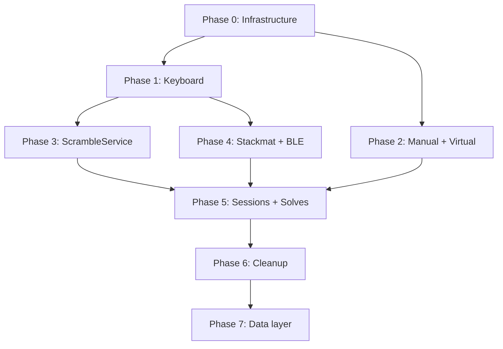

# Migration Plan

## Principle

Incremental migration. At each phase, the app must keep working.
Phases can be done in separate PRs.

---

## Phase 0: Base Infrastructure

**Goal**: have the fundamental pieces without breaking anything existing.

1. **Result type** - Create `src/lib/core/domain/Result.ts` with `Ok`, `Err`, `Result<T, E>`.
2. **Domain events** - Create `src/lib/events/domain/TimerEvents.ts` with all events defined in [events.md](events.md).
3. **TimerState class** - Create `src/lib/timer/TimerState.ts` with `$state` for all timer reactive state (`timerState`, `time`, `ready`, `scramble`, `solves`, `lastSolve`, etc.).
4. **TimerReactor** - Create `src/lib/timer/TimerReactor.ts` that subscribes to EventBus and updates `TimerState`. Initially without side effects (doesn't save solves, doesn't generate scrambles).

**Result**: EventBus + events + TimerState + TimerReactor exist but are not used yet.

---

## Phase 1: Keyboard Device (Main Device Migration)

**Goal**: the most used device works with the new system.

1. **Create new KeyboardDevice** - `src/lib/devices/KeyboardDevice.ts`. Internal XState, emits events to EventBus, receives `onTimeUpdate` callback.
2. **Connect to TimerReactor** - The reactor updates `TimerState` when Keyboard events arrive.
3. **Connect UI** - `Timer.svelte` reads from `TimerState` ($state) instead of `TimerController` stores.
4. **Side effects in reactor** - Add solve saving, scramble generation (using existing `TimerController` as a temporary bridge).
5. **Verify flows** - CLEAN→PREVENTION→READY→RUNNING→STOPPED, cancel, inspection, penalties, multi-step.

**Result**: Keyboard works with event-driven. Other devices continue with the old system.

---

## Phase 2: Manual and Virtual Devices

**Goal**: migrate the simple devices.

1. **ManualDevice** - Only emits `DeviceStopped(time)` when the user enters a time.
2. **VirtualDevice** - Emits `DeviceStartedRunning` on the first move, `DeviceStopped` on solve.

**Result**: 3 of the main devices migrated.

---

## Phase 3: ScrambleService

**Goal**: decouple scramble generation from TimerController.

1. **Create ScrambleService** - With fallback system (see [scramble.md](scramble.md)).
2. **Register CstimerGenerator** as global generator.
3. **Connect to reactor** - After `DeviceStopped`, the reactor requests a scramble from ScrambleService.
4. **Move preview image** - As a separate side effect from the scramble.

**Result**: scrambles decoupled. TimerController no longer handles scrambles.

---

## Phase 4: Stackmat and Bluetooth Devices

**Goal**: migrate hardware devices.

1. **StackmatDevice** - Rewrite with XState + EventBus. Internal audio processing stays the same.
2. **GANDevice** - Rewrite with XState + EventBus. BLE communication stays the same.
3. **QYTimerDevice** - Similar to Stackmat.
4. **IDeviceDiscovery** - Implement `WebDeviceDiscovery` and `ElectronDeviceDiscovery`.

**Result**: all devices migrated to the new system.

---

## Phase 5: Session Switching & Solve CRUD via Events

**Goal**: migrate session and solve operations to EventBus.

1. **Session events** - `SessionSwitched`, `SessionCreated`, etc. (see [sessions.md](sessions.md)).
2. **Solve events** - `SolveUpdated`, `SolvesRemoved`, `PenaltyChanged` (see [solves.md](solves.md)).
3. **Connect handlers** - The reactor processes these events and executes use cases.

**Result**: the entire flow is event-driven.

---

## Phase 6: Cleanup

**Goal**: remove legacy code.

1. **Remove TimerController** - Replaced by TimerReactor + TimerState + services.
2. **Remove InputContext** - Replaced by IDevice + EventBus.
3. **Remove Emitter** - Replaced by EventBus.
4. **Remove old stores** - Replaced by $state.
5. **Remove adaptors/** - Replaced by devices/.

**Result**: clean codebase, no dual code.

---

## Phase 7: Data Layer via Events

**Goal**: the data backend is selected by environment and communicates via events.

1. **EnvironmentDetector** - Detects whether we're in Electron, web, or Capacitor.
2. **Data events** - Repositories emit/listen to events for async operations.
3. **Adapter selection** - The factory selects the correct adapter based on the detected environment.

---

## Phase Dependency Diagram

- Phases 1 and 2 can be done in parallel.
- Phases 3 and 4 can be done in parallel after Phase 1.
- Phase 5 requires all devices to be migrated.
- Phase 6 only happens when everything works.
- Phase 7 is independent but benefits from the cleanup.

---

## Golden Rule

At any point between phases, the app must work.
If something fails, the incomplete phase is reverted, not forced forward.
