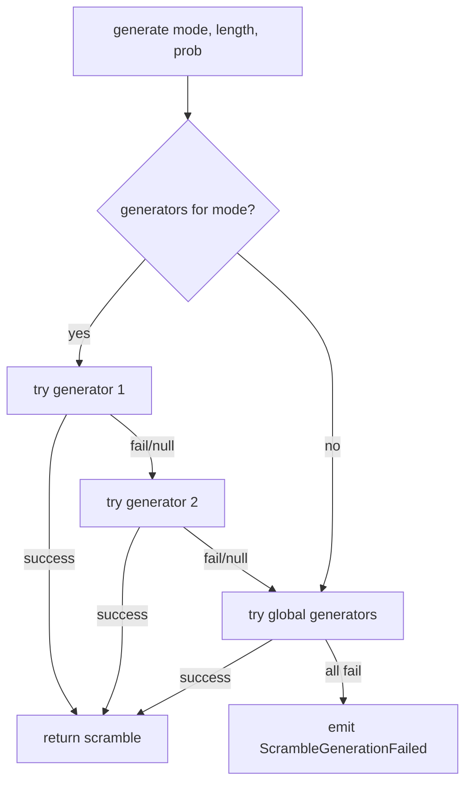

# Scramble System

## Principle

The scramble is controlled by the Timer via events, not by devices.
Generation is asynchronous (can run in a worker/separate thread to avoid blocking the UI).

## ScrambleService

Independent service that manages scramble generation with a fallback system
between multiple registered generators.

```ts
interface ScrambleGenerator {
  /** Generator identifier (e.g., "cstimer", "cubing.js") */
  readonly id: string;

  /**
   * Generates a scramble for the given mode.
   * @returns The generated scramble, or null if this generator doesn't support the mode.
   * @throws If an error occurs during generation.
   */
  generate(mode: string, length: number, prob?: number | number[]): Promise<string | null>;

  /**
   * Indicates whether this generator supports a given mode.
   * Useful for quick skip without attempting generation.
   */
  supports(mode: string): boolean;
}

class ScrambleService {
  /** Generators per mode, ordered by priority (lower index = higher priority) */
  private generators: Map<string, ScrambleGenerator[]> = new Map();

  /** Global generators (apply to any mode if supported) */
  private globalGenerators: ScrambleGenerator[] = [];

  /**
   * Registers a generator for a specific mode.
   * Added to the end of the priority list for that mode.
   */
  register(mode: string, generator: ScrambleGenerator): void;

  /**
   * Registers a global generator (fallback for any mode).
   */
  registerGlobal(generator: ScrambleGenerator): void;

  /**
   * Generates a scramble. Goes through generators in priority order.
   * If all fail, emits an error event.
   *
   * @returns The generated scramble.
   * @throws ScrambleGenerationFailed if no generator could produce a result.
   */
  async generate(mode: string, length: number, prob?: number | number[]): Promise<string>;
}
```

### Generation Flow (Fallback)



### Registration Example

```ts
const scrambleService = new ScrambleService();

// cstimer as the main generator for most modes
scrambleService.registerGlobal(new CstimerGenerator());

// Specialized generator for FTO (if cstimer doesn't support it well)
scrambleService.register('fto', new FTOGenerator());
```

## Relationship with the Timer

The Timer controls when a scramble is generated. The ScrambleService only generates.

```
Timer receives DeviceStopped
  → Timer saves solve
  → Timer requests scramble from ScrambleService
  → ScrambleService generates (async, can be in worker)
  → Timer receives scramble
  → Timer emits ScrambleGenerated
  → UI shows scramble
  → (side effect) generates preview image if supported
```

## Image Preview (Side Effect)

The preview image is independent of scramble generation.

```ts
interface ScrambleImageGenerator {
  /** Indicates if it can generate an image for this mode */
  supports(mode: string): boolean;

  /** Generates preview images for the scramble */
  generate(scramble: string, mode: string): Promise<string[]>;
}
```

- Runs after the scramble is ready.
- If the image generator doesn't support the mode, no image is generated.
- Does not block the timer flow.

## Persistence

The scramble is NOT persisted between app restarts.
Each time the app starts, a new scramble is generated.
The PRNG depends on date/time as seed.

## Events

```ts
/** Error generating scramble: no generator could produce a result */
export class ScrambleGenerationFailed implements DomainEvent {
  readonly type = 'ScrambleGenerationFailed';
  readonly timestamp = Date.now();
  readonly aggregate = 'Timer';

  constructor(
    public readonly mode: string,
    public readonly errors: Array<{ generatorId: string; error: string }>,
  ) {}
}
```
