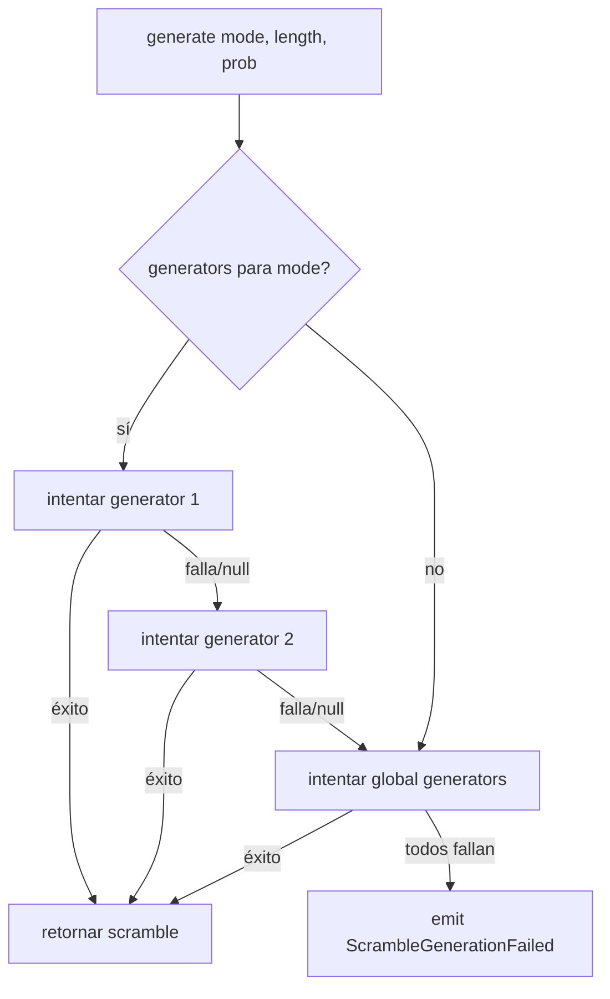

# Scramble System

## Principio

El scramble es controlado por el Timer via eventos, no por los devices.
La generación es asíncrona (puede ejecutarse en un worker/hilo separado para no bloquear la UI).

## ScrambleService

Servicio independiente que gestiona la generación de scrambles con un sistema de fallback
entre múltiples generadores registrados.

```ts
interface ScrambleGenerator {
  /** Identificador del generador (e.g., "cstimer", "cubing.js") */
  readonly id: string;

  /**
   * Genera un scramble para el modo dado.
   * @returns El scramble generado, o null si este generador no soporta el modo.
   * @throws Si ocurre un error durante la generación.
   */
  generate(mode: string, length: number, prob?: number | number[]): Promise<string | null>;

  /**
   * Indica si este generador soporta un modo dado.
   * Útil para skip rápido sin intentar generar.
   */
  supports(mode: string): boolean;
}

class ScrambleService {
  /** Generadores por modo, ordenados por prioridad (menor index = mayor prioridad) */
  private generators: Map<string, ScrambleGenerator[]> = new Map();

  /** Generadores globales (aplican a cualquier modo si lo soportan) */
  private globalGenerators: ScrambleGenerator[] = [];

  /**
   * Registra un generador para un modo específico.
   * Se añade al final de la lista de prioridad para ese modo.
   */
  register(mode: string, generator: ScrambleGenerator): void;

  /**
   * Registra un generador global (fallback para cualquier modo).
   */
  registerGlobal(generator: ScrambleGenerator): void;

  /**
   * Genera un scramble. Recorre los generadores en orden de prioridad.
   * Si todos fallan, emite un evento de error.
   *
   * @returns El scramble generado.
   * @throws ScrambleGenerationFailed si ningún generador pudo producir resultado.
   */
  async generate(mode: string, length: number, prob?: number | number[]): Promise<string>;
}
```

### Flujo de generación (fallback)



### Ejemplo de registro

```ts
const scrambleService = new ScrambleService();

// cstimer como generador principal para la mayoría de modos
scrambleService.registerGlobal(new CstimerGenerator());

// Generador especializado para FTO (si cstimer no lo soporta bien)
scrambleService.register('fto', new FTOGenerator());
```

## Relación con el Timer

El Timer controla cuándo se genera un scramble. El ScrambleService solo genera.

```
Timer recibe DeviceStopped
  → Timer guarda solve
  → Timer pide scramble al ScrambleService
  → ScrambleService genera (async, puede ser en worker)
  → Timer recibe scramble
  → Timer emite ScrambleGenerated
  → UI muestra scramble
  → (side effect) genera imagen de preview si es soportado
```

## Preview de imagen (side effect)

La imagen de preview es independiente de la generación del scramble.

```ts
interface ScrambleImageGenerator {
  /** Indica si puede generar imagen para este modo */
  supports(mode: string): boolean;

  /** Genera las imágenes de preview del scramble */
  generate(scramble: string, mode: string): Promise<string[]>;
}
```

- Se ejecuta después de que el scramble esté listo.
- Si el generador de imágenes no soporta el modo, no se genera imagen.
- No bloquea el flujo del timer.

## Persistencia

El scramble NO se persiste entre reinicios de la app.
Cada vez que la app arranca, genera un scramble nuevo.
El PRNG depende de la fecha/hora como seed.

## Eventos

```ts
/** Error al generar scramble: ningún generador pudo producir resultado */
export class ScrambleGenerationFailed implements DomainEvent {
  readonly type = 'ScrambleGenerationFailed';
  readonly timestamp = Date.now();
  readonly aggregate = 'Timer';

  constructor(
    public readonly mode: string,
    public readonly errors: Array<{ generatorId: string; error: string }>,
  ) {}
}
```
