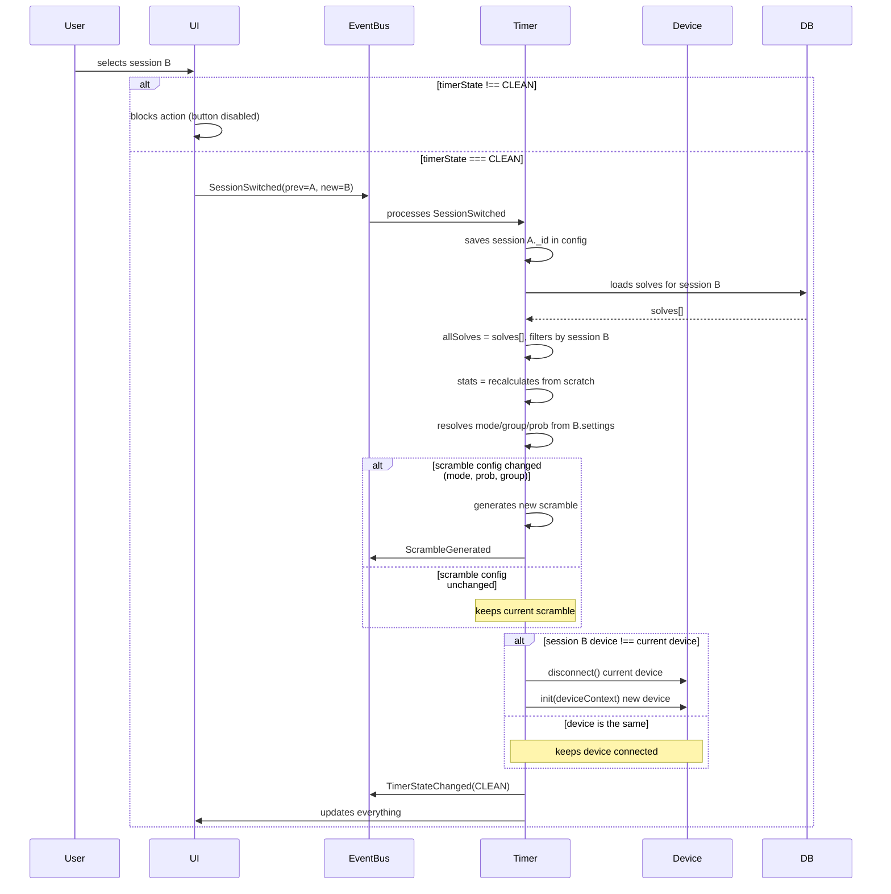
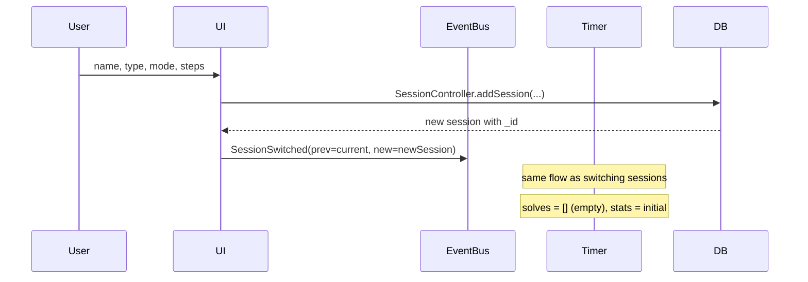
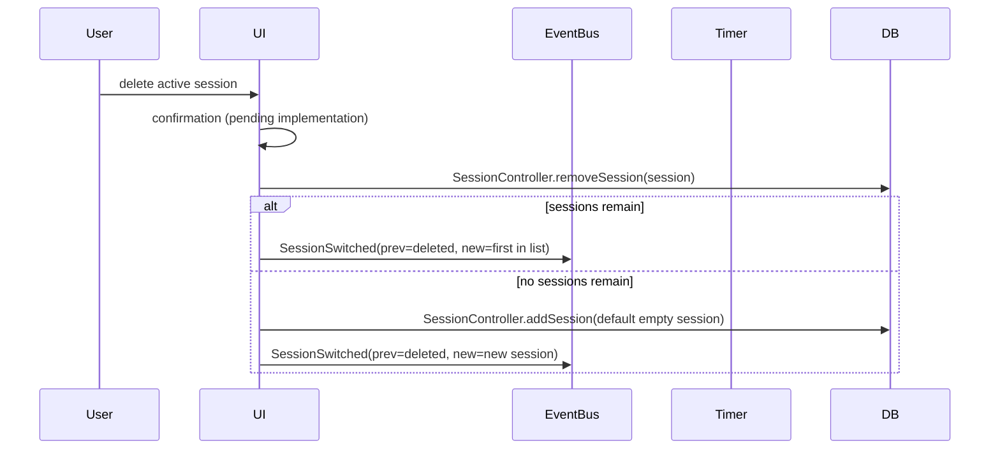

# Session Switching

## Rules

1. **Cannot switch sessions while the timer is not in CLEAN.**
   The UI must block the session selector when `timerState !== CLEAN`.
   If the switch is somehow forced, the solve is cancelled (`DeviceCancelled`).

2. **The active device depends on the session.**
   Each session has `settings.input` indicating the preferred device.
   Default is Keyboard. The list of available devices for a session
   is filtered by compatibility (e.g., GAN iCarry doesn't make sense for 4x4).
   When switching sessions:
   - If the new session's device is **the same** as the current one → don't disconnect.
   - If it's **different** → disconnect the current one, connect the new one.

3. **In "mixed" sessions, configuration is persisted automatically.**
   When the user changes group/mode/filter in a mixed session,
   it's saved immediately to `session.settings`.

4. **Deleting the active session**: go to the first session in the list.
   If none remain, create a new empty one. (Preferably, deletion
   happens from the session list, not from the active timer.)

5. **The scramble is kept if configurations match.**
   The scramble depends on: `mode`, `prob`, and potentially `group`.
   If when switching sessions all these configurations are identical,
   the current scramble is kept (no point regenerating an unused one).
   If any differ, a new one is generated.

## Flow: Switch Session

## Flow: Create New Session

## Flow: Delete Active Session

