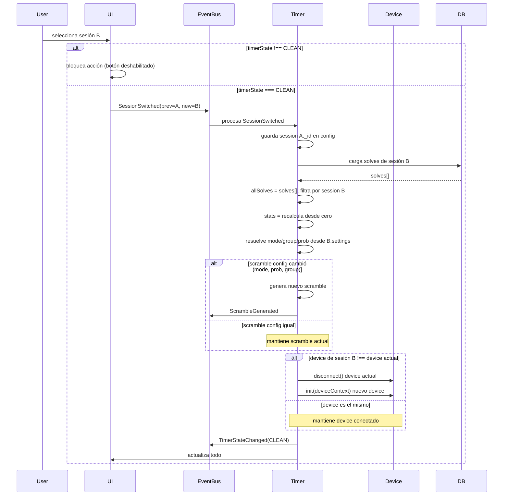
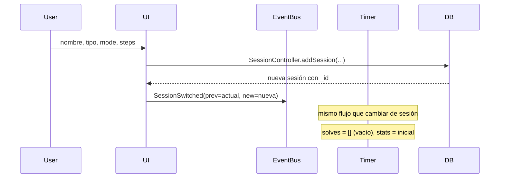
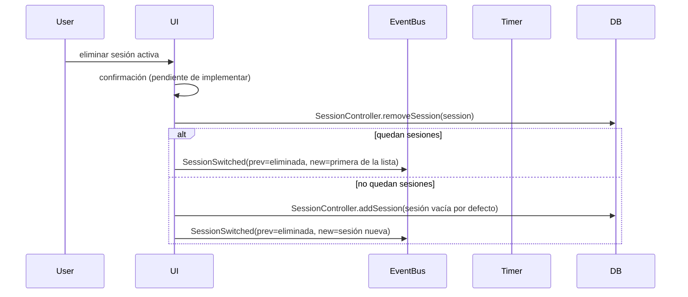

# Session Switching

## Reglas

1. **No se puede cambiar de sesión mientras el timer no esté en CLEAN.**
   La UI debe bloquear el selector de sesiones cuando `timerState !== CLEAN`.
   Si por alguna razón se fuerza el cambio, el solve se cancela (`DeviceCancelled`).

2. **El device activo depende de la sesión.**
   Cada sesión tiene `settings.input` que indica el device preferido.
   Por defecto es Keyboard. La lista de devices disponibles para una sesión
   se filtra por compatibilidad (e.g., GAN iCarry no tiene sentido para 4x4).
   Al cambiar de sesión:
   - Si el device de la nueva sesión es **el mismo** que el actual → no se desconecta.
   - Si es **diferente** → desconectar el actual, conectar el nuevo.

3. **En sesiones "mixed", la configuración se persiste automáticamente.**
   Cuando el usuario cambia group/mode/filter en una sesión mixed,
   se guarda inmediatamente en `session.settings`.

4. **Eliminar la sesión activa**: ir a la primera sesión de la lista.
   Si no queda ninguna, crear una nueva vacía. (Preferiblemente, la eliminación
   ocurre desde la lista de sesiones, no desde el timer activo.)

5. **El scramble se mantiene si las configuraciones coinciden.**
   El scramble depende de: `mode`, `prob`, y potencialmente `group`.
   Si al cambiar de sesión todas estas configuraciones son idénticas,
   el scramble actual se conserva (no tiene sentido regenerar uno no usado).
   Si alguna difiere, se genera uno nuevo.

## Flujo: cambiar de sesión

## Flujo: crear nueva sesión

## Flujo: eliminar sesión activa

