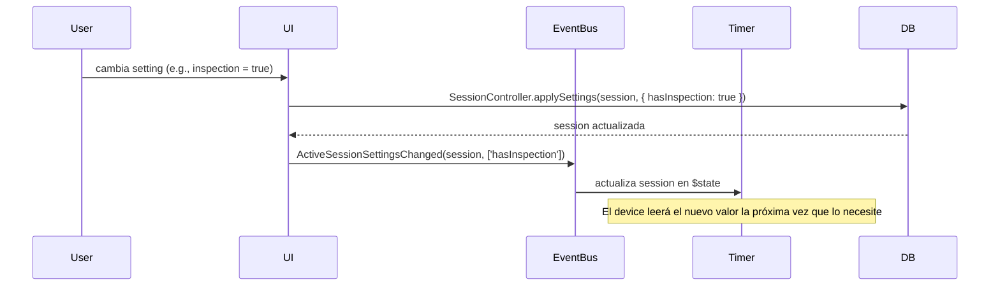

# Settings

## Tipos de configuración

Hay dos sistemas completamente separados:

### 1. Session Settings

Configuración específica de cada sesión. Cada sesión tiene su propia configuración.
No existen settings globales que apliquen a todas las sesiones.

```ts
interface SessionSettings {
  hasInspection: boolean;
  inspection: number;           // segundos de inspección
  showElapsedTime: boolean;
  calcAoX: AverageSetting;
  genImage: boolean;
  scrambleAfterCancel: boolean;
  input?: string;               // device ID preferido
  withoutPrevention: boolean;
  recordCelebration?: boolean;
  showBackFace?: boolean;
  sessionType?: SessionType;    // 'mixed' | 'single' | 'multi-step'
  mode?: string;                // scramble mode (e.g., '333', 'pyram')
  prob?: number | number[];     // sub-scramble filter
  steps?: number;
  stepNames?: string[];
}
```

### 2. App Config

Configuración de la aplicación (UI, dispositivos, preferencias generales).
Key-value flexible. Completamente separado de session settings.

Incluye: tema, idioma, layout, datos de dispositivos bluetooth,
última sesión activa, y configuraciones impredecibles que cada módulo
necesite persistir.

## Lectura de settings por devices

Los devices leen `session.settings` de forma lazy:
- No necesitan reinicializarse cuando un setting cambia.
- Leen el valor actual la próxima vez que lo necesitan.
- Acceden via `TimerReadonlyView.session` (Readable).

Ejemplo: si el usuario activa `hasInspection` mientras el timer está en CLEAN,
el Keyboard device leerá el nuevo valor cuando el usuario presione space
y decida si ir a INSPECTION o no.

## Propagación de cambios



No hay reinicialización de devices. No hay broadcast especial.
El cambio se persiste en DB, se actualiza el `$state`, y el device
lo lee cuando toca.
