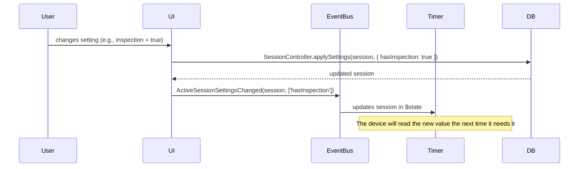

# Settings

## Configuration Types

There are two completely separate systems:

### 1. Session Settings

Configuration specific to each session. Each session has its own configuration.
There are no global settings that apply to all sessions.

```ts
interface SessionSettings {
  hasInspection: boolean;
  inspection: number;           // inspection seconds
  showElapsedTime: boolean;
  calcAoX: AverageSetting;
  genImage: boolean;
  scrambleAfterCancel: boolean;
  input?: string;               // preferred device ID
  withoutPrevention: boolean;
  recordCelebration?: boolean;
  showBackFace?: boolean;
  sessionType?: SessionType;    // 'mixed' | 'single' | 'multi-step'
  mode?: string;                // scramble mode (e.g., '333', 'pyram')
  prob?: number | number[];     // sub-scramble filter
  steps?: number;
  stepNames?: string[];
}
```

### 2. App Config

Application configuration (UI, devices, general preferences).
Flexible key-value. Completely separate from session settings.

Includes: theme, language, layout, bluetooth device data,
last active session, and unpredictable configurations that each module
needs to persist.

## Settings Reading by Devices

Devices read `session.settings` lazily:
- They don't need to reinitialize when a setting changes.
- They read the current value the next time they need it.
- They access via `TimerReadonlyView.session` (Readable).

Example: if the user activates `hasInspection` while the timer is in CLEAN,
the Keyboard device will read the new value when the user presses space
and decides whether to go to INSPECTION or not.

## Change Propagation



No device reinitialization. No special broadcast.
The change is persisted to DB, `$state` is updated, and the device
reads it when needed.
