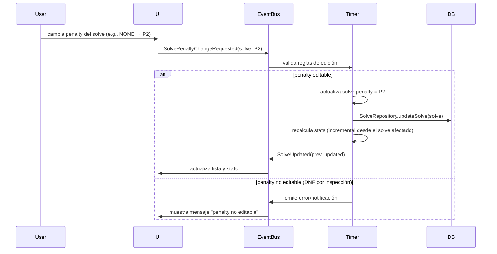
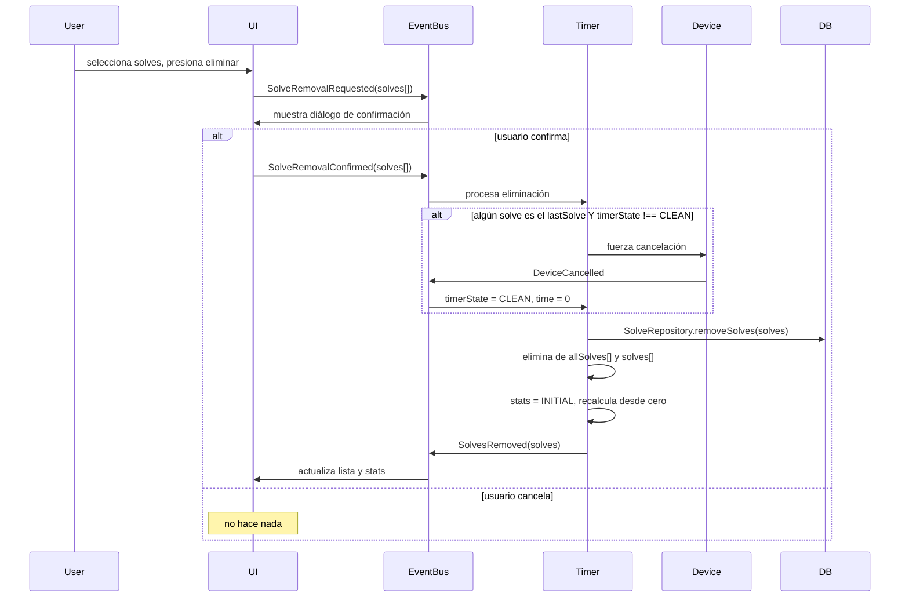
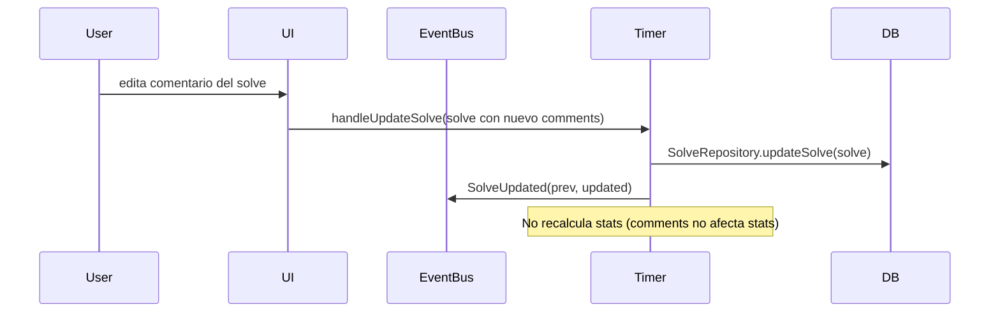

# Solve CRUD

## Reglas de edición de penalties

Las reglas de edición dependen del **origen** del penalty:

| Origen | Penalty actual | Puede cambiar a |
|---|---|---|
| Sin penalty | NONE | P2, DNF |
| +2 manual | P2 | NONE, DNF |
| DNF manual | DNF | NONE, P2 |
| +2 por inspección | P2 | DNF (quitar solo si fue accidente) |
| DNF por inspección | DNF | **No editable** |

Nota: el solve debe registrar el origen del penalty para poder aplicar estas reglas.

```ts
/**
 * Información del penalty para determinar reglas de edición.
 */
interface PenaltyInfo {
  penalty: Penalty;
  source: 'none' | 'manual' | 'inspection';
}
```

## Reglas generales

- **Tiempo no es editable** después de guardar. Solo se puede añadir manualmente (Manual device).
- **Comentarios** son editables siempre.
- **Eliminación en batch**: se pueden seleccionar y eliminar múltiples solves. Requiere confirmación.
- **Eliminar lastSolve**: si el timer no está en CLEAN, forzar transición a CLEAN
  (emitir `DeviceCancelled` si hay un solve en progreso).
- **Solve pertenece a una única sesión.** No se comparten entre sesiones.

## Flujo: editar penalty



## Flujo: eliminar solves



## Flujo: editar comentarios



## Recálculo de estadísticas

```
Cuándo se recalcula:
├── SolveAdded       → incremental (solo el nuevo solve)
├── SolveUpdated     → desde el punto del solve afectado (si cambió penalty/time)
├── SolvesRemoved    → desde cero (INITIAL_STATISTICS)
└── SessionSwitched  → desde cero (nueva sesión, nuevos solves)

Optimización futura:
  En vez de recalcular todo desde INITIAL_STATISTICS al eliminar,
  recalcular desde el solve más antiguo afectado.
  Esto requiere que las estadísticas sean indexables por posición.
```
