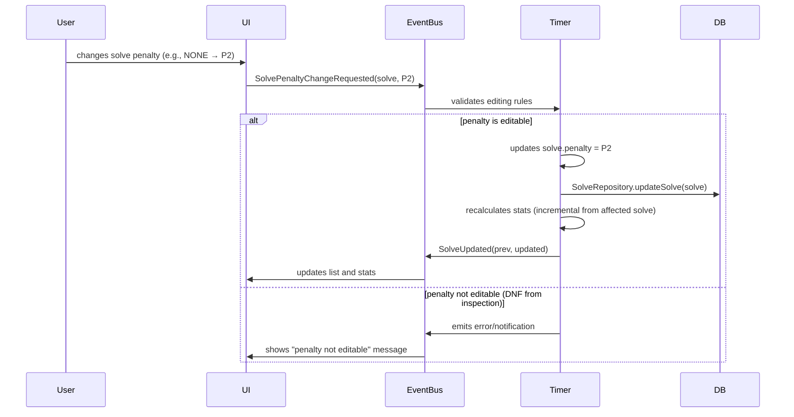
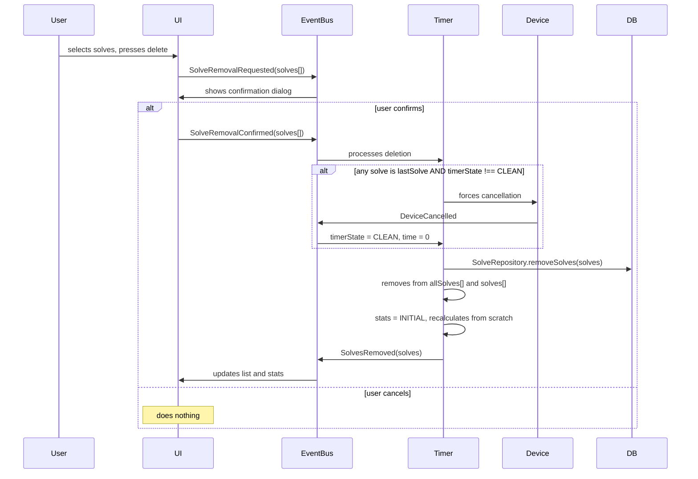
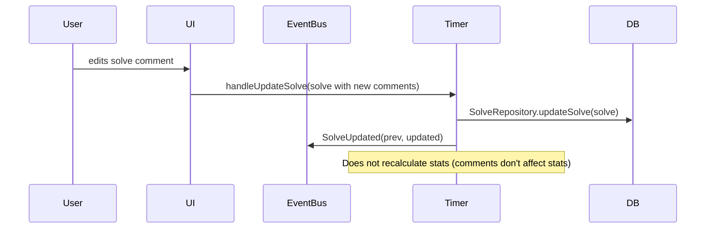

# Solve CRUD

## Penalty Editing Rules

Editing rules depend on the **origin** of the penalty:

| Origin | Current penalty | Can change to |
|---|---|---|
| No penalty | NONE | P2, DNF |
| Manual +2 | P2 | NONE, DNF |
| Manual DNF | DNF | NONE, P2 |
| +2 from inspection | P2 | DNF (remove only if accidental) |
| DNF from inspection | DNF | **Not editable** |

Note: the solve must record the penalty origin to enforce these rules.

```ts
/**
 * Penalty info to determine editing rules.
 */
interface PenaltyInfo {
  penalty: Penalty;
  source: 'none' | 'manual' | 'inspection';
}
```

## General Rules

- **Time is not editable** after saving. Can only be added manually (Manual device).
- **Comments** are always editable.
- **Batch deletion**: multiple solves can be selected and deleted. Requires confirmation.
- **Deleting lastSolve**: if the timer is not in CLEAN, force transition to CLEAN
  (emit `DeviceCancelled` if there's a solve in progress).
- **A solve belongs to a single session.** They are not shared between sessions.

## Flow: Edit Penalty



## Flow: Delete Solves



## Flow: Edit Comments



## Statistics Recalculation

```
When to recalculate:
├── SolveAdded       → incremental (only the new solve)
├── SolveUpdated     → from the affected solve's position (if penalty/time changed)
├── SolvesRemoved    → from scratch (INITIAL_STATISTICS)
└── SessionSwitched  → from scratch (new session, new solves)

Future optimization:
  Instead of recalculating everything from INITIAL_STATISTICS on deletion,
  recalculate from the oldest affected solve.
  This requires statistics to be indexable by position.
```
