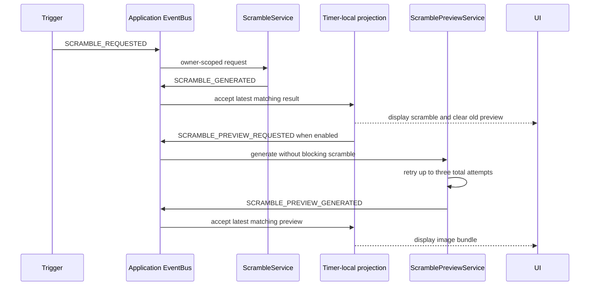

# Event-Driven Scramble and Preview Design

**Date:** 2026-07-16

**Status:** Approved design

**Scope:** Migrate timer scramble generation and scramble preview generation to the application-scoped EventBus as an independently reversible vertical slice. Solve persistence remains on its current path for this slice.

**Related documents:**

- `docs/superpowers/specs/2026-07-12-timer-event-driven-migration-design.md`
- `docs/superpowers/plans/2026-07-12-timer-event-driven-migration.md`
- `docs/architecture/timer/scramble.md`
- `docs/architecture/core/services.md`
- `docs/architecture/timer/handlers.md`

## Purpose

The timer currently generates scrambles and preview images directly through `TimerController`. Typed scramble events already exist, but the production application does not publish or handle them. Preview generation has no typed event contract.

This slice introduces two autonomous services:

- `ScrambleService` generates or accepts scrambles and publishes results.
- `ScramblePreviewService` generates preview image bundles independently after a scramble is accepted.

The services communicate only through the application-scoped EventBus. Timer-local handlers project owner-scoped results into reactive state. Image generation never blocks scramble display.

## Goals

- Generate and display scrambles through typed owner-scoped events.
- Generate preview image bundles as a separate non-blocking event flow.
- Preserve browser timestamps for direct user requests.
- Prevent stale and cross-owner results from updating timer state.
- Make scramble and preview activity visible in the event debugger.
- Preserve the current generator and image paths behind a migration flag.
- Include tests for every contract, service, trigger, projection, bridge, and debugger change.

## Non-Goals

- Migrating solve persistence, statistics, or penalty editing.
- Adding persistent preview-image caching.
- Moving scramble or image generation into a worker in this slice.
- Removing `TimerController.initScrambler` or its image helpers.
- Migrating session persistence or the complete session-settings flow.
- Changing scramble algorithms or their distribution.

## Authoritative Trigger Rules

A new scramble is requested in exactly these situations:

1. A solve completes successfully and the timer stops. The request occurs after the existing solve-save operation has been invoked.
2. The user requests a new scramble directly, including the refresh control.
3. The user cancels while the timer is in the running phase and the active session has `scrambleAfterCancel` enabled.
4. Initial session selection or a later session change produces a different scramble mode or probability from the currently displayed scramble configuration.

Cancellation during prevention or inspection retains the current scramble regardless of `scrambleAfterCancel`.

An edited, user-provided scramble uses the same request/result flow but bypasses random generation. It is normalized, displayed, and used for preview generation.

Changing `genImage` never changes the scramble:

- Enabling it requests a preview for the current scramble.
- Disabling it clears the current preview and invalidates pending preview results.

## Architecture

### Application-Scoped Services

`ScrambleService` and `ScramblePreviewService` are created by the application timer composition root. They share the application EventBus and event factory with DeviceManager and the event logger.

Services do not mutate `TimerState`, Svelte stores, or UI components. Timer-local handlers subscribe to result facts and update only the matching owner's reactive state.

### Scramble Generators

`ScrambleService` receives an ordered collection of generators. Each generator declares whether it supports a mode and generates from mode, length, and probability. The existing CSTimer generator is wrapped behind this interface and remains the initial primary generator.

For a generated request, the service tries supported generators in priority order. A null result or thrown error advances to the next generator. A provided scramble bypasses the generator list but still passes through the established normalization behavior.

If every generator fails, the service publishes a failure fact containing the normalized errors. The timer retains its last valid scramble and preview. No empty or fabricated scramble replaces valid state.

### Preview Generators

`ScramblePreviewService` receives a preview-generator interface backed initially by the existing `scrambleToPuzzle` and `pGenerateCubeBundle` functions.

The service handles one preview request independently from scramble generation. Unsupported modes clear the preview without producing an error. A supported generation failure receives two immediate retries, for three total attempts. Success publishes the image bundle and number of attempts used. After the third failed attempt, the service publishes one final failure fact and performs no further work.

Preview failures do not produce user notifications. They remain visible in the event debugger, and the timer remains usable without an image.

### Reactive State

The event-driven timer read model gains:

- the accepted scramble and its effective configuration;
- the latest scramble request ID;
- the preview image bundle;
- the latest preview request ID;
- whether preview generation is currently enabled.

Only matching result facts update this state. When a new scramble is accepted, its previous preview is cleared before a new preview request is published.

## Event Contract

All event names remain centralized in `TIMER_EVENTS`. All payloads are explicit entries in `TimerEventPayloadMap`.

### Scramble Events

`SCRAMBLE_REQUESTED` contains:

- `ownerId`;
- `mode`;
- `length`;
- `probability` as `number | number[]`;
- `source` as one of `solve-completed`, `user-requested`, `running-cancelled`, or `session-scramble-settings-changed`;
- an optional user-provided scramble.

The request event envelope ID is the scramble request ID.

`SCRAMBLE_GENERATED` contains:

- `ownerId`;
- originating `requestId`;
- normalized `scramble`;
- effective mode, length, and probability;
- request source.

`SCRAMBLE_GENERATION_FAILED` contains:

- `ownerId`;
- originating `requestId`;
- requested configuration and source;
- an ordered list of generator IDs and normalized errors.

### Preview Events

The registry adds request, generated, failed, and cleared events under the timer scramble-preview namespace.

`SCRAMBLE_PREVIEW_REQUESTED` contains:

- `ownerId`;
- originating `scrambleRequestId`;
- scramble and mode.

Its event envelope ID is the preview request ID.

`SCRAMBLE_PREVIEW_GENERATED` contains:

- `ownerId`;
- originating `scrambleRequestId` and preview `requestId`;
- image bundle;
- attempts used.

`SCRAMBLE_PREVIEW_GENERATION_FAILED` contains:

- `ownerId`;
- both request IDs;
- attempts used, fixed at three for the final failure;
- normalized final error.

`SCRAMBLE_PREVIEW_CLEARED` contains:

- `ownerId`;
- related scramble request ID when one exists;
- a reason identifying a new scramble, disabled images, an unsupported mode, or a final generation failure.

Programmatic result events use the injected monotonic clock. Direct click or keyboard requests use the native browser event timestamp captured before publication.

## Data Flow



If scramble generation fails, `SCRAMBLE_GENERATION_FAILED` is published and the previous state remains. If preview generation fails three times, a final failure and cleared fact leave the preview empty without affecting the scramble.

## Concurrency and Stale Results

The application may contain multiple timer owners and several asynchronous requests may overlap.

- Every request carries `ownerId`.
- Every result references the originating request event ID.
- A timer-local projection ignores events for other owners.
- A scramble result is accepted only when its request ID is still the owner's latest scramble request.
- A preview result is accepted only when both its preview request and scramble request remain current and preview generation is enabled.
- Late results are still logged for diagnostics even when projections ignore them.
- Destroying a timer runtime removes its handlers. Destroying the application runtime stops both services and prevents later results from mutating state.

## Migration Bridge and Reversibility

A `scramble` migration flag selects the event-driven flow. The existing timer context method remains the compatibility boundary for legacy devices and UI callers:

- with the flag enabled, it creates and publishes a typed request;
- with the flag disabled, it calls `TimerController.initScrambler` exactly as it does now.

Until solve persistence migrates, the managed keyboard completion bridge invokes the current save behavior before publishing the next scramble request. A later solve-persistence slice moves that trigger to the successful `SOLVE_ADDED` flow without changing the scramble-service contract.

Legacy generator and preview methods remain available for rollback. Disabling the flag or reverting this commit group restores the current path without reverting the keyboard architecture.

## Event Debugger

The console-style debugger recognizes scramble request, generated, failure, preview request, preview generated, preview failure, and preview-cleared events. Each category receives a distinguishable icon and color while retaining the existing collapsed payload inspection.

Retry attempts remain internal to `ScramblePreviewService`. The success event reports attempts used; only the final failed attempt publishes a failure event, avoiding noisy intermediate retry events.

## Testing Strategy

Every changed part receives tests in the same commit group.

### Contract Tests

- Registry values remain unique.
- Every new event has a typed payload-map entry.
- Probability accepts a number or list and rejects unrelated types.
- Result events require owner and request identity.
- Direct user requests preserve native timestamps.
- Service results use the injected monotonic clock.

### Unit Tests

- Scramble generator priority, support checks, null results, thrown errors, provided scrambles, normalization, and total failure.
- Preview supported and unsupported modes, first-attempt success, retry success, three-attempt failure, and teardown.
- Trigger matrix for completed stop, direct request, running cancellation setting, prevention/inspection cancellation, and session configuration changes.
- Preview enable/disable behavior without scramble replacement.
- Owner filtering and stale scramble/preview rejection.
- Migration bridge behavior with the flag enabled and disabled.
- Event-debugger icon and classification coverage.

### Integration Tests

Integration tests use the real EventBus and deterministic fakes for generators and clocks. They prove:

- scramble text projects before a delayed preview completes;
- rapid requests leave the newest scramble and preview visible;
- two owners cannot project each other's results;
- a completed managed-keyboard run invokes the legacy save bridge before requesting the next scramble;
- running cancellation follows `scrambleAfterCancel`, while inspection cancellation never advances;
- initial and changed session configuration request the correct scramble;
- disabling images while a request is pending prevents its result from appearing;
- all event IDs and timestamp rules survive the complete flow.

## Manual Acceptance

The user validates the slice on the real `/timer/<sessionId>` route before dependent migration work begins:

- initial scramble and preview;
- direct refresh and edited scramble;
- completed solve;
- running cancellation with the option enabled and disabled;
- inspection cancellation;
- session mode and probability changes;
- enabling and disabling image generation;
- rapid repeated refreshes where the newest scramble and image must win;
- debugger visibility for every request and result category.

## Verification

No build and no `svelte-check` are run for this slice. Verification consists of:

```text
pnpm exec eslint .
pnpm exec tsc --noEmit -p tsconfig.json --pretty false
pnpm test:unit --run --maxWorkers=1
```

Focused Vitest commands run throughout implementation before the full unit suite.

## Completion Criteria

This slice is complete when:

- all approved scramble triggers publish through the application EventBus;
- scramble and preview services never mutate timer or UI state directly;
- owner and request identity prevent stale and cross-owner projection;
- preview generation is non-blocking and stops after three total failed attempts;
- image setting changes never replace the scramble;
- the debugger exposes the complete flow;
- the legacy path remains selectable and tested;
- lint, TypeScript, focused tests, and the full unit suite pass without a build or `svelte-check`;
- the user accepts behavior on the production timer route.
