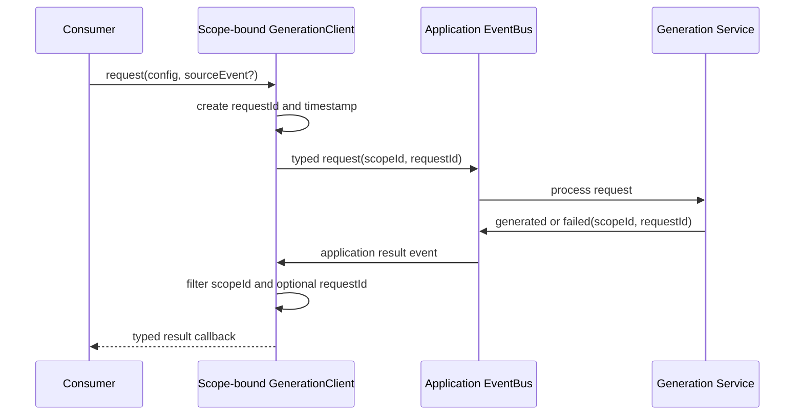

# Scoped Generation Client Design

**Date:** 2026-07-17

**Status:** Approved design

**Scope:** Generalize scramble and image generation behind scope-bound clients over the application EventBus. Timer, device, tool, tutorial, and algorithm-image consumers use the same public API without knowing event names or event-envelope details.

**Related documents:**

- `docs/superpowers/specs/2026-07-16-event-driven-scramble-preview-design.md`
- `docs/superpowers/specs/2026-07-14-event-driven-device-management-design.md`
- `docs/architecture/timer/scramble.md`
- `docs/architecture/core/services.md`

## Purpose

The current event-driven scramble implementation is functional but exposes timer-specific concepts and requires producers to know how to construct and publish timer events. That makes unrelated consumers, such as iCarry controllers, scramble tools, tutorials, and algorithm-image views, depend on timer event details.

This design introduces a scope-bound generation client. Consumers ask for scrambles or images through a small typed API. The client owns request identity, timestamps, event construction, publication, subscription, scope filtering, and cleanup. Application-scoped services process all requests equally.

Scramble generation and image generation remain independent capabilities. A future `cubicdb-module` adapter may implement either or both internally without coupling their application contracts.

## Goals

- Hide event names, envelopes, factories, and bus publication from feature components.
- Give every request a required stable scope and unique request identity.
- Prevent timers and other consumers from observing results from another scope.
- Support concurrent requests within one scope without imposing timer-specific policies.
- Keep scramble configuration independent from image-render configuration.
- Support single and batch generation through one consistent result shape.
- Preserve native browser timestamps for directly triggered requests.
- Keep services application-scoped, replaceable, testable, and reversible.

## Non-Goals

- Adding cross-tab transport through `BroadcastChannel`.
- Replacing the custom application EventBus.
- Migrating solve persistence or penalty handling.
- Implementing `cubicdb-module` in this slice.
- Making image generation a prerequisite for displaying a scramble.
- Imposing a global latest-request-wins rule.

## Architecture

### Application Runtime

The application runtime owns:

- the single application `EventBus`;
- the typed application event factory;
- one application-scoped scramble service;
- one application-scoped image-generation service;
- a `createGenerationClient(scopeId)` factory.

Feature composition roots receive a client already bound to their scope:

```ts
const generation = applicationRuntime.createGenerationClient(timerId);
```

The client is not a static global facade. Explicit construction keeps dependencies testable and teardown deterministic while still giving every feature access to the same application bus and services.

### Scope Identity

Every generation request requires a stable `scopeId`.

- Inside a timer, the scope ID is exactly the timer's existing ID. It is not prefixed, translated, or duplicated.
- Tools, tutorials, algorithm viewers, and other environments define their own stable IDs.
- All results and failures copy the originating `scopeId` and `requestId`.
- A scope-bound client automatically ignores events belonging to other scopes.
- A consumer may additionally filter by `requestId` when several requests are active within one scope.

Scope identity provides routing, not ownership or exclusivity. Device leasing remains a separate concern.

### Public Client

The public API exposes independent scramble and image capabilities:

```ts
const requestId = generation.scrambles.request(config, options);
const detach = generation.scrambles.onGenerated(requestId, handler);

generation.images.request(config, options);
generation.images.onGenerated(handler);
```

Both capabilities support:

- `request(config, options?)`, returning the generated request ID;
- request-specific success and failure subscriptions;
- scope-level success and failure subscriptions;
- detach functions for every subscription;
- client teardown that detaches all subscriptions created by that client.

Components do not import event constants, create event envelopes, publish directly to the bus, or repeat scope filters.

## Separate Generation Contracts

### Scramble Configuration

Scramble configuration describes what scramble data to generate and contains no image settings:

```ts
interface ScrambleGenerationConfig {
  mode: string;
  count?: number;
  length?: number;
  probability?: number | number[];
}
```

`count` defaults to one. Existing normalization and generator-specific defaults remain behind the scramble-service adapter.

### Image Configuration

Image configuration receives existing scramble data and describes only rendering:

```ts
interface ImageGenerationConfig {
  scramble: string;
  puzzle: PuzzleType;
  mode: CubeMode;
  view: CubeView;
  order?: number | number[];
}
```

`CubeMode` and `CubeView` control separate parts of rendering:

- `mode` selects the puzzle-state presentation, such as normal, OLL, or PLL;
- `view` selects the visual projection, such as `plan`, `trans`, `2d`, or `bird`.

Both are explicit in the image request so a normal 3x3 scramble can be rendered with any supported mode and viewpoint without changing scramble generation. Temporary compatibility adapters may use the existing `trans` default when translating a legacy caller, but new callers provide the view explicitly.

Additional renderer options may be added to this contract when required. They must not be folded into the scramble contract.

### Result Shape

Both services always return arrays, including single-item requests:

```ts
interface ScrambleGenerationResult {
  scopeId: string;
  requestId: string;
  scrambles: string[];
}

interface ImageGenerationResult {
  scopeId: string;
  requestId: string;
  images: string[];
}
```

This gives timer views and batch tools the same contract and avoids parallel single-item and batch APIs.

## Event Contract

Generation event names remain centralized in one application event registry. Their typed payloads are entries in the application payload map.

The contract contains these event families:

```text
generation.scramble.requested
generation.scramble.generated
generation.scramble.failed

generation.image.requested
generation.image.generated
generation.image.retrying
generation.image.failed
```

Every event envelope contains:

- a unique event ID;
- an always-present monotonic timestamp;
- its typed payload.

Every request payload contains `scopeId` and its generation configuration. The request event ID is the `requestId`. Result, retry, and failure payloads contain the originating `scopeId` and `requestId`.

The public client is the normal publication boundary. Direct bus publication remains possible for infrastructure and tests but is not the feature-component API.

## Timestamp Rules

Request methods accept an optional native source event:

```ts
generation.scrambles.request(config, { sourceEvent: event });
```

- When a click, keyboard event, or other native browser input caused the request, the client copies `sourceEvent.timeStamp` into the request envelope.
- Programmatic requests use the injected monotonic clock.
- Service-generated result, retry, and failure events use the injected monotonic clock.
- A timestamp is never omitted from an event.

The client may expose a lower-level explicit timestamp option for adapters that already captured a native timestamp, but components should normally pass the native event.

## Request Lifecycle and Concurrency



The generation client does not impose latest-request-wins globally. Tools may intentionally run several requests concurrently. A timer projection may remember its latest request ID and reject older results as a timer-specific display policy.

Late results remain available to the event debugger even when a projection ignores them.

## Failure and Retry Policy

Scramble-service failures publish one typed final failure containing normalized diagnostic information. The consumer retains its previous valid scramble.

Image generation receives up to three total attempts. The image service owns this retry policy:

- a successful attempt publishes the image result;
- failed attempts before the last publish retry diagnostics;
- the third failed attempt publishes one final failure;
- no additional retry or user-facing interruption occurs;
- image failure never prevents scramble display or timer operation.

Retry activity remains visible in the event debugger without requiring feature components to understand it.

## Service and Adapter Boundaries

The application-scoped services subscribe to all matching application requests and treat every scope equally. They do not mutate Svelte stores, timer state, or UI components.

Initial adapters wrap the existing scramble and image implementations. Later, separate `cubicdb-module` adapters may replace them:

- a scramble adapter implements scramble generation;
- an image adapter implements rendering;
- both adapters may share one underlying library instance without merging their public application contracts.

This boundary permits independent replacement and rollback of scramble and image generation.

## Timer Integration

The timer composition root obtains a client whose `scopeId` equals the timer ID. Timer controls, lifecycle handlers, and device integrations call that client rather than publishing generation events themselves.

The timer projection:

- listens only through its scope-bound client;
- records the latest scramble request ID where latest-result display is required;
- displays accepted scramble results immediately;
- requests images separately for the accepted scramble;
- keeps scramble and image state independent;
- ignores stale image results when a newer scramble or image request exists.

An iCarry controller or another device can request a scramble through the same timer-bound client without importing timer event definitions.

## Event Debugger

The debugger remains attached directly to the application bus so it can display all scopes. Generation entries expose scope ID and request ID and start collapsed like other console entries.

Scramble request/result/failure and image request/result/retry/failure events receive distinguishable categories or icons. Debugger visibility does not change routing or consume events.

## Migration and Reversibility

Implementation is divided into testable commit groups:

1. Add generic scoped generation contracts and type tests without changing production behavior.
2. Add the scope-bound generation client and filtering/lifecycle tests.
3. Adapt scramble generation to the generic contracts while preserving the current generator.
4. Connect the timer scramble flow through its scope-bound client and stop for manual validation.
5. Add the independent image service and its three-attempt retry tests.
6. Connect timer preview rendering and stop for manual validation.
7. Remove superseded timer-owner-specific generation contracts only after both production flows are accepted.

Each group is independently reviewable and revertible. Compatibility adapters may temporarily translate old timer-specific events into generic requests, but new feature code must use the client boundary.

No commit group removes the last working path before its replacement passes automated and manual acceptance.

## Testing Strategy

Every commit group includes tests for each changed part.

### Contract Tests

- Event names are unique and payload-map entries are complete.
- All request, result, retry, and failure events require scope and request identity.
- Scramble and image configuration types remain independent.
- Single and batch results always use arrays.
- Native and programmatic timestamp rules are enforced.

### Client Unit Tests

- Requests create unique IDs and publish the bound scope.
- Native source timestamps and injected-clock timestamps are preserved.
- Scope-level subscriptions reject other scopes.
- Request-level subscriptions reject other request IDs.
- Concurrent requests within one scope are not silently discarded.
- Detach and client teardown remove subscriptions.

### Service Unit Tests

- Scramble single/batch generation, defaults, normalization, and final failure.
- Image rendering for independent `CubeMode` values.
- Image rendering for independent `CubeView` projections.
- Image success on attempts one, two, and three.
- Image final failure after exactly three attempts.
- Service teardown prevents later publication.

### Integration Tests

Using the real application EventBus and deterministic adapters and clocks:

- two timers cannot observe each other's results;
- one scope can complete concurrent requests independently;
- a timer accepts only its latest display request while a batch tool accepts all results;
- a normal scramble can produce an OLL or PLL image request;
- the same scramble and mode can produce different supported `CubeView` projections;
- scramble display does not wait for image generation;
- an image failure does not replace or clear the valid scramble;
- debugger logging observes the complete flow without changing it.

## Manual Acceptance Checkpoints

After timer scramble integration, the user validates:

- initial scramble;
- direct refresh and edit;
- completed solve and configured cancellation behavior;
- session changes;
- rapid requests and debugger scope/request identity.

After timer image integration, the user validates:

- normal preview generation;
- independent OLL/PLL-style render selection where available;
- independent `plan`, `trans`, `2d`, and `bird` view selection where supported;
- image enable/disable behavior;
- non-blocking scramble display;
- visible retry/failure diagnostics.

Implementation does not continue beyond either visible checkpoint until the user evaluates the production route.

## Verification

No build and no `svelte-check` are run. Verification uses focused tests throughout, followed by the repository's lint, TypeScript, and unit-test commands that do not build the application.

## Completion Criteria

This design is complete when:

- feature consumers request generation without importing event names or publishing to the bus;
- timer scope IDs exactly match timer IDs;
- scope and request filtering prevent cross-consumer contamination;
- scramble and image contracts and services remain independent;
- single and batch results share array-based contracts;
- native and programmatic events always carry correct timestamps;
- image generation stops after three failed attempts;
- every migration group has automated tests and a reversible boundary;
- both timer checkpoints are manually accepted.
